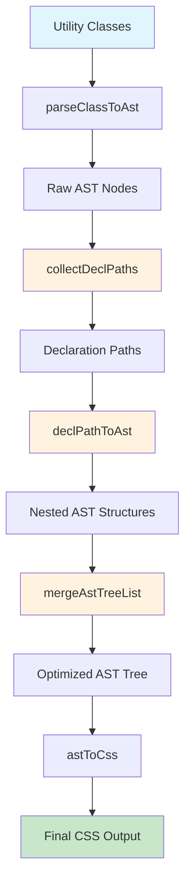
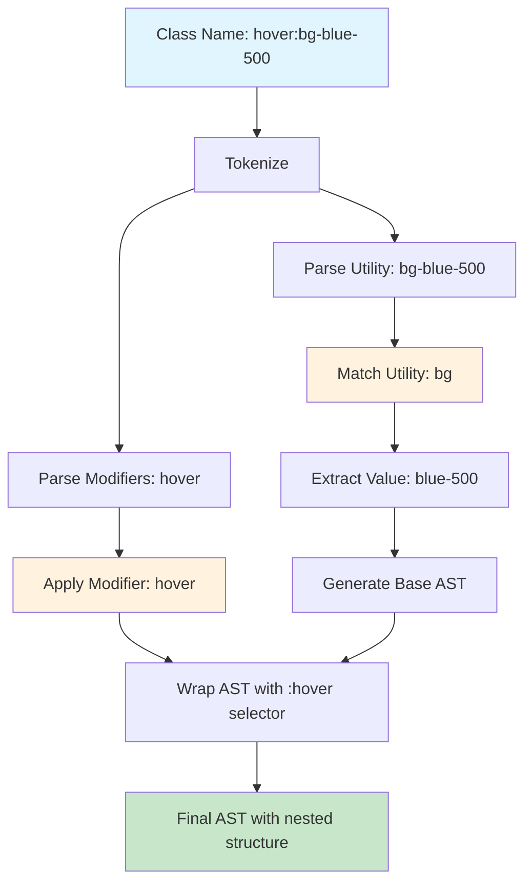

# Engine API

::: tip Learning Path
This is **Step 2** in the BaroCSS API learning path. Learn how CSS is generated from utility classes.
:::

The Engine API provides the core functionality for parsing class names, building Abstract Syntax Trees (ASTs), and generating CSS. This is the foundation that powers all CSS generation in BaroCSS.

## 🎯 What You'll Learn

- How utility classes are parsed into ASTs
- The CSS generation process step by step
- Core functions for processing classes
- How to use the engine directly

## 📚 Prerequisites

- **[Context API](/api/context)** - Understanding contexts and configuration
- **[Parser API](/api/parser)** - Understanding class parsing and tokenization

## 📚 Next Steps

After mastering the Engine API, continue with:
- **[AST Processing API](/api/ast-processing)** - Detailed AST manipulation
- **[Static Utility API](/api/static-utility)** - Creating custom utilities
- **[Functional Utility API](/api/functional-utility)** - Creating dynamic utilities

## CSS Generation Process

BaroCSS transforms utility classes into optimized CSS through a sophisticated AST processing pipeline. The `@optimizeAst()` function is the core of this process.

### Process Overview



### Step-by-Step Breakdown

#### 1. Parse Utility Classes
```typescript
// Input: "hover:bg-blue-500"
const ast = parseClassToAst('hover:bg-blue-500', ctx);
// Output: Raw AST nodes with variant structure
```

#### 2. Collect Declaration Paths
```typescript
const declPaths = collectDeclPaths(ast);
// Extracts all paths from AST tree to declaration nodes
```

#### 3. Convert to Nested AST
```typescript
const astList = declPaths.map(declPathToAst);
// Converts each path to properly nested AST structure
```

#### 4. Merge and Optimize
```typescript
const merged = mergeAstTreeList(astList);
// Merges multiple AST trees into single optimized tree
```

#### 5. Generate CSS
```typescript
const css = astToCss(merged);
// Converts optimized AST to final CSS output
```

For detailed information about this process, see the [AST Processing API](/api/ast-processing).

## Utility and Modifier Connection

The Engine API is responsible for connecting utilities with their modifiers to generate CSS. This process involves several key components working together:

### 1. Utility Registration System

Utilities are registered in the global registry and matched against class names:

```typescript
// Utility registration example
registerUtility({
  name: 'bg',
  match: (className) => className.startsWith('bg-'),
  handler: (value, ctx, token) => {
    const color = ctx.theme('colors', value);
    return [decl('background-color', color)];
  },
  category: 'background',
  description: 'Background color utilities'
});
```

### 2. Modifier Plugin System

Modifiers (variants) are handled through a plugin system that can modify selectors and wrap AST nodes:

```typescript
// Static modifier example
staticModifier('hover', ['&:hover'], {
  source: 'pseudo',
  sort: 10
});

// Functional modifier example
functionalModifier(
  (mod) => mod.startsWith('sm:'),
  ({ selector }) => ({
    selector: `@media (min-width: 640px) { ${selector} }`,
    wrappingType: 'at-rule',
    source: 'responsive'
  })
);
```

### 3. Class Name Parsing Process

When a class name like `hover:bg-blue-500` is processed:

1. **Tokenization**: Split into `['hover', 'bg-blue-500']`
2. **Utility Matching**: Find `bg` utility that matches `bg-blue-500`
3. **Modifier Processing**: Apply `hover` modifier to the utility
4. **Value Extraction**: Extract `blue-500` as the utility value
5. **AST Generation**: Create AST nodes with proper nesting

### 4. Connection Flow



### 5. Modifier Processing Details

Modifiers can affect CSS generation in multiple ways:

#### Selector Modification
```typescript
// Input: hover:bg-blue-500
// Modifier: hover
// Result: &:hover { background-color: #3b82f6; }
```

#### Media Query Wrapping
```typescript
// Input: sm:bg-blue-500
// Modifier: sm (responsive)
// Result: @media (min-width: 640px) { & { background-color: #3b82f6; } }
```

#### Complex Nesting
```typescript
// Input: sm:dark:hover:bg-blue-500
// Modifiers: sm, dark, hover
// Result: @media (min-width: 640px) { .dark &:hover { background-color: #3b82f6; } }
```

### 6. Utility Value Resolution

The engine resolves utility values through the context system:

```typescript
// Theme-based resolution
const color = ctx.theme('colors', 'blue-500'); // #3b82f6

// Arbitrary value handling
const arbitrary = ctx.theme('colors', '[#ff0000]'); // #ff0000

// Custom property handling
const custom = ctx.theme('colors', '(var(--my-color))'); // var(--my-color)
```

### 7. Priority and Sorting

Utilities and modifiers are processed in priority order:

```typescript
// Utility priority example
registerUtility({
  name: 'bg',
  priority: 10, // Higher priority = processed first
  // ...
});

// Modifier priority example
staticModifier('hover', ['&:hover'], {
  sort: 20, // Higher sort = applied later (outer wrapper)
});
```

## parseClassToAst: The Core Connection Function

The `parseClassToAst` function is the heart of the Engine API, responsible for connecting utilities with their modifiers to generate AST structures. This function orchestrates the entire process from class name parsing to final AST generation.

### Function Signature

```typescript
function parseClassToAst(
  fullClassName: string,
  ctx: Context
): AstNode[]
```

### Step-by-Step Process

#### 1. **Caching and Validation**
```typescript
// Check failure cache for invalid classes
if (failureCache.has(fullClassName)) {
  return [];
}

// Check AST cache for previously processed classes
const cacheKey = `${fullClassName}:${contextHash}`;
if (astCache.has(cacheKey)) {
  return astCache.get(cacheKey)!;
}
```

#### 2. **Class Name Parsing**
```typescript
const { modifiers, utility } = parseClassName(fullClassName);
// Example: 'sm:dark:hover:bg-blue-500'
// modifiers: [{ type: 'sm' }, { type: 'dark' }, { type: 'hover' }]
// utility: { prefix: 'bg', value: 'blue-500', ... }
```

#### 3. **Utility Matching and Handler Execution**
```typescript
const utilReg = getUtility().find((u) => {
  const fullClassName = utility.value
    ? `${utility.prefix}-${utility.value}`
    : utility.prefix;
  return u.match(fullClassName);
});

// Execute utility handler to generate base AST
let ast = utilReg.handler(value!, ctx, utility, utilReg) || [];
// Result: [{ type: "decl", prop: "background-color", value: "#3b82f6" }]
```

#### 4. **Modifier Processing Loop**
```typescript
const wrappers = [];
const selector = "&";

for (let i = 0; i < modifiers.length; i++) {
  const variant = modifiers[i];
  const plugin = getModifierPlugins().find((p) => p.match(variant.type, ctx));
  
  if (plugin.modifySelector) {
    const result = plugin.modifySelector({
      selector,
      fullClassName,
      mod: variant,
      context: ctx,
      variantChain: modifiers,
      index: i,
    });
    // Process result and add to wrappers array
  }
}
```

#### 5. **Wrapper Nesting (Right-to-Left)**
```typescript
// Nest wrappers in N→0 (right→left) order
for (let i = wrappers.length - 1; i >= 0; i--) {
  const wrap = wrappers[i];
  
  if (wrap.type === "rule") {
    ast = [{
      type: "rule",
      selector: wrap.selector!,
      source: wrap.source,
      nodes: Array.isArray(ast) ? ast : [ast],
    }];
  } else if (wrap.type === "at-rule") {
    ast = [{
      type: "at-rule",
      name: wrap.name || "media",
      params: wrap.params!,
      source: wrap.source,
      nodes: Array.isArray(ast) ? ast : [ast],
    }];
  }
}
```


### Key Features

#### 1. **Caching System**
- **Failure Cache**: Remembers invalid classes to avoid reprocessing
- **AST Cache**: Caches successful results with context hash
- **Context-Aware**: Cache keys include theme and configuration changes

#### 2. **Error Handling**
- Graceful handling of unknown utilities and modifiers
- Warning messages for debugging
- Returns empty array for invalid classes

#### 3. **Flexible Wrapper System**
- Supports multiple wrapper types: `rule`, `at-rule`, `style-rule`, `wrap`
- Right-to-left nesting for proper CSS structure
- Source tracking for debugging and optimization

#### 4. **At-Root Extraction**
- Automatically extracts `@at-root` nodes to the top level
- Maintains proper CSS structure for root-level declarations

### Performance Optimizations

1. **Multi-level Caching**: Prevents redundant processing
2. **Early Returns**: Fails fast for invalid classes
3. **Efficient Lookups**: Uses optimized utility and modifier matching
4. **Memory Management**: Clears caches when context changes

## Core Functions


### optimizeAst()

The core function that merges and organizes AST generated by `parseClassToAst` into an optimized AST tree based on declaration-to-root paths.

```typescript
import { optimizeAst, parseClassToAst, createContext } from '@barocss/kit';

const ctx = createContext();
const ast = parseClassToAst('hover:bg-blue-500 focus:ring-2', ctx);
const optimized = optimizeAst(ast);
```

**Parameters:**
- `ast` (AstNode[]): AST nodes from `parseClassToAst`

**Returns:**
- `AstNode[]`: Optimized AST tree with merged and organized structure

**Process:**
1. **Collect Declaration Paths**: Extracts all paths from AST tree to declaration nodes
2. **Convert to Nested AST**: Converts each path to properly nested AST structure
3. **Merge and Optimize**: Merges multiple AST trees into single optimized tree

**Example:**
```typescript
// Input AST from parseClassToAst
const ast = [
  {
    type: "rule",
    selector: "&:hover",
    source: "pseudo",
    nodes: [
      { type: "decl", prop: "background-color", value: "#3b82f6" }
    ]
  },
  {
    type: "rule",
    selector: "&:focus",
    source: "pseudo",
    nodes: [
      { type: "decl", prop: "box-shadow", value: "0 0 0 2px #3b82f6" }
    ]
  }
];

// After optimizeAst
const optimized = optimizeAst(ast);
// Returns merged and optimized AST structure
```

### generateCss()

Generates CSS from a space-separated list of class names.

```typescript
import { generateCss, createContext } from '@barocss/kit';

const ctx = createContext();
const css = generateCss('bg-blue-500 text-white p-4', ctx);
```

**Parameters:**
- `classList` (string): Space-separated class names
- `ctx` (Context): BaroCSS context
- `opts` (object, optional): Generation options

**Options:**
```typescript
interface GenerateOptions {
  minify?: boolean;  // Minify CSS output
  dedup?: boolean;   // Remove duplicate classes
}
```

**Returns:**
- `string`: Generated CSS

**Example:**
```typescript
const css = generateCss('bg-blue-500 hover:bg-blue-600 focus:ring-2', ctx, {
  minify: true,
  dedup: true
});
```

### generateCssRules()

Generates detailed CSS rules for multiple classes with metadata.

```typescript
import { generateCssRules, createContext } from '@barocss/kit';

const ctx = createContext();
const rules = generateCssRules('bg-blue-500 text-white', ctx);
```

**Parameters:**
- `classList` (string): Space-separated class names
- `ctx` (Context): BaroCSS context
- `opts` (object, optional): Generation options

**Returns:**
- `GenerateCssRulesResult[]`: Array of detailed rule objects

**Rule Object:**
```typescript
interface GenerateCssRulesResult {
  cls: string;        // Original class name
  ast: AstNode[];     // AST nodes
  css: string;        // Generated CSS
  cssList: string[];  // Individual CSS rules
  rootCss: string;    // Root CSS variables
  rootCssList: string[]; // Individual root rules
}
```


## AST Node Types

BaroCSS uses a comprehensive AST system for representing CSS structures.

### AstNode Types

```typescript
type AstNode =
  | { type: "decl"; prop: string; value: string | [string, string][]; source?: string }
  | { type: "rule"; selector: string; nodes: AstNode[]; source?: string }
  | { type: "style-rule"; selector: string; nodes: AstNode[]; source?: string }
  | { type: "at-rule"; name: string; params: string; nodes: AstNode[]; source?: string }
  | { type: "at-root"; nodes: AstNode[]; source?: string }
  | { type: "comment"; text: string; source?: string }
  | { type: "raw"; value: string; source?: string }
  | { type: "wrap"; items: AstNode[]; source?: string };
```

### AST Helper Functions

```typescript
import { 
  decl, 
  rule, 
  styleRule, 
  atRule, 
  atRoot, 
  comment, 
  raw 
} from '@barocss/kit';

// Create declaration
const colorDecl = decl('color', 'red');

// Create rule
const buttonRule = rule('.button', [colorDecl]);

// Create at-rule
const mediaRule = atRule('media', '(min-width: 768px)', [buttonRule]);

// Create at-root
const rootRule = atRoot([colorDecl]);
```

## CSS Generation Pipeline

The CSS generation process follows this pipeline:

1. **Parse**: `parseClassName()` - Tokenize and parse class names
2. **AST**: `parseClassToAst()` - Build Abstract Syntax Tree
3. **Optimize**: `optimizeAst()` - Merge and organize AST nodes
4. **Generate**: `astToCss()` - Convert AST to CSS string

```typescript
// Complete pipeline example
const className = 'sm:dark:hover:bg-red-500';

// 1. Parse class name
const { modifiers, utility } = parseClassName(className);

// 2. Build AST
const ast = parseClassToAst(className, ctx);

// 3. Optimize AST
const optimized = optimizeAst(ast);

// 4. Generate CSS
const css = astToCss(optimized, className);
```


## Related APIs

- [Context API](/api/context) - Theme and configuration management
- [Parser API](/api/parser) - Class name parsing and tokenization
- [AST Processing API](/api/ast-processing) - Advanced AST manipulation
- [Static Utility API](/api/static-utility) - Creating custom utilities
- [Functional Utility API](/api/functional-utility) - Creating dynamic utilities
- [Browser Runtime](/api/browser-runtime) - Browser integration
- [Server Runtime](/api/server-runtime) - Server-side usage
