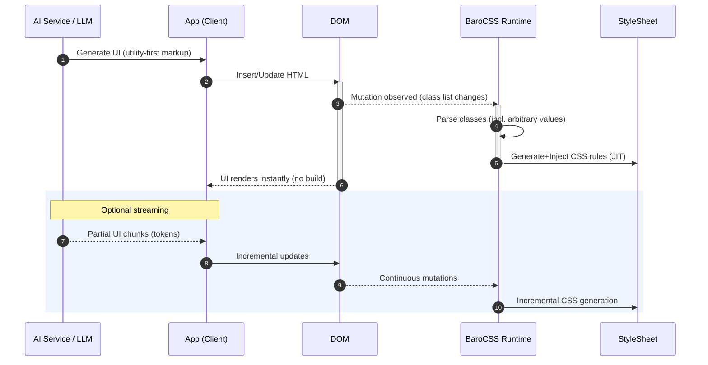

# AI Integration

BaroCSS enables real-time rendering of AI-generated UI without any build steps. This guide explains the typical flow (AI → DOM → BaroCSS) and shows minimal code to get it working.

## Flow Overview

- AI generates markup using utility-first classes (Tailwind syntax supported)
- Your app injects the markup into the DOM
- BaroCSS observes DOM changes and generates CSS in real time

## Diagram



## Minimal Setup

```ts
import { BrowserRuntime } from 'barocss/runtime/browser'

// 1) Initialize runtime once
const runtime = new BrowserRuntime({
  config: {
    // Optional theme/config
  }
})

// 2) Observe the document (scans existing DOM and watches for changes)
runtime.observe(document.body, { scan: true })
```

## Rendering AI-Generated Components

```ts
// Example: AI returns a component string using Tailwind syntax
const aiComponent = `
  <div class="flex items-center justify-between p-[1.5rem] bg-white rounded-[0.75rem]
              shadow-[0_4px_6px_-1px_rgba(0,0,0,0.1)] w-[400px] h-[120px]">
    <h2 class="text-[1.25rem] font-semibold text-gray-800 leading-[1.4]">AI Generated</h2>
    <button class="px-[1rem] py-[0.5rem] bg-blue-500 text-white rounded-[0.375rem]
                    hover:bg-blue-600 transition-colors duration-[200ms] w-[120px]">
      Action
    </button>
  </div>
`

// Insert into the DOM
const mount = document.getElementById('app')!
mount.innerHTML = aiComponent

// BaroCSS detects the change and generates CSS instantly (no build step)
```

## Dynamic Arbitrary Values

AI can emit precise, data-driven styles using arbitrary values, and BaroCSS will parse them in real time:

```ts
function renderAICard(data: { color: string; title: string; description: string }) {
  const { color, title, description } = data
  return `
    <div class="bg-${color}-50 border-l-[4px] border-${color}-500 p-[1rem]
                rounded-r-[0.5rem] shadow-[0_4px_6px_-1px_rgba(0,0,0,0.1)]
                w-[420px] h-[160px]">
      <h3 class="text-[1rem] font-medium text-${color}-800 mb-[0.25rem]">${title}</h3>
      <p class="text-[0.875rem] text-${color}-700 leading-[1.5]">${description}</p>
    </div>
  `
}
```

## Notes

- No bundler or rebuild loop is required; styles appear instantly.
- Works with streaming/iterative AI outputs — the runtime continuously observes DOM changes.
- The same approach applies to frameworks (React/Vue/Svelte) when rendering AI content.


