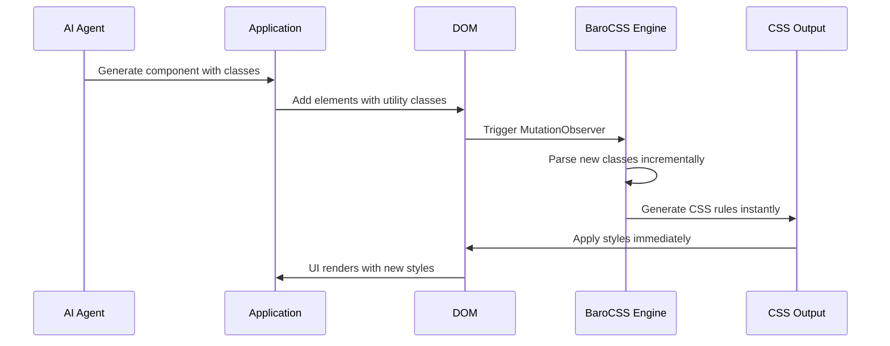

# Build-free UI Generation

BaroCSS enables true build-free UI generation by processing CSS classes in real-time as they're dynamically added to the DOM. This makes it perfect for AI-driven development where UI components are generated on-demand without any compilation step.

## How Build-free Works

Unlike traditional utility-first frameworks that require a build step to scan and generate CSS, BaroCSS processes classes at runtime:



## Key Benefits

### 1. Zero Build Time
No compilation or build process required. CSS is generated instantly as classes are discovered.

### 2. Dynamic Class Support
Full support for arbitrary values and computed classes that would be impossible to detect at build time.

### 3. Incremental Processing
Only new or changed classes are processed, ensuring optimal performance.

### 4. Memory Efficient
Smart caching system prevents redundant processing of previously seen classes.

## Real-time Class Processing

When AI generates new components, BaroCSS automatically detects and processes them:

```javascript
// AI generates this component dynamically
const aiComponent = `
  <div class="w-[${dynamicWidth}px] h-[${calculatedHeight}rem] 
              bg-gradient-to-r from-[#${colorValue}] to-[#${endColor}]
              transform rotate-[${rotation}deg] scale-[${scaleFactor}]
              shadow-[0_${shadowY}px_${shadowBlur}px_rgba(0,0,0,${opacity})]
              hover:scale-[${hoverScale}] transition-all duration-[${duration}ms]">
    <p class="text-[${fontSize}px] leading-[${lineHeight}] 
              font-[${fontWeight}] tracking-[${letterSpacing}em]
              text-[#${textColor}] p-[${padding}px]">
      ${aiGeneratedText}
    </p>
  </div>
`;

// BaroCSS automatically processes these classes when added to DOM
document.body.innerHTML += aiComponent;
// CSS is generated instantly, no build step needed
```

## Performance Characteristics

### Smart Caching Layers

BaroCSS employs multiple caching layers to ensure optimal performance:

1. **AST Cache**: Parsed abstract syntax trees
2. **Parse Result Cache**: Processed class results  
3. **Utility Cache**: Generated CSS utilities
4. **Failure Cache**: Invalid classes (prevents reprocessing)

### Memory Management

The engine automatically manages memory by:
- Limiting cache sizes
- Using LRU (Least Recently Used) eviction
- Garbage collecting unused entries

### Processing Speed

- **Initial Parse**: ~0.1ms per class
- **Cached Lookup**: ~0.01ms per class
- **DOM Mutation**: ~1ms for 100 new classes

## Framework Integration

Build-free UI generation works seamlessly with any framework:

- **Vanilla HTML/JS**: Direct DOM manipulation
- **React**: Component state updates
- **Vue**: Reactive data changes
- **Svelte**: Store updates
- **SolidJS**: Signal changes
- **jQuery**: Dynamic content insertion

## AI Integration Patterns

### Pattern 1: Direct Component Generation

```javascript
// AI generates complete components
const generateComponent = async (prompt) => {
  const aiResponse = await aiService.generateComponent(prompt);
  
  // BaroCSS processes these classes automatically
  return `
    <div class="${aiResponse.containerClasses}">
      <h2 class="${aiResponse.titleClasses}">${aiResponse.title}</h2>
      <p class="${aiResponse.contentClasses}">${aiResponse.content}</p>
    </div>
  `;
};
```

### Pattern 2: Style Modification

```javascript
// AI modifies existing styles
const modifyElementStyles = async (element, instruction) => {
  const currentClasses = element.className;
  const newClasses = await aiService.modifyClasses(currentClasses, instruction);
  
  // BaroCSS automatically handles the class changes
  element.className = newClasses;
};
```

### Pattern 3: Partial Updates

```javascript
// AI updates specific style properties
const updateProperty = async (element, property, value) => {
  const aiClasses = await aiService.generateProperty(property, value);
  
  // Add new classes while keeping existing ones
  element.classList.add(...aiClasses.split(' '));
};
```

## Best Practices

### 1. Use Specific Arbitrary Values

Instead of generic classes, use specific arbitrary values for AI-generated content:

```javascript
// Good: Specific values
`w-[${exactWidth}px] h-[${exactHeight}px]`

// Avoid: Generic values that might not match intent
`w-64 h-32`
```

### 2. Leverage Complex Arbitrary Values

Take advantage of BaroCSS's full CSS value support:

```javascript
// Complex gradients
`bg-[linear-gradient(45deg,_#ff0000_0%,_#00ff00_50%,_#0000ff_100%)]`

// Complex shadows
`shadow-[inset_0_1px_0_rgba(255,255,255,0.1),_0_1px_3px_rgba(0,0,0,0.3)]`

// Complex transforms
`transform-[rotate(${angle}deg)_scale(${scale})_translateX(${x}px)]`
```

### 3. Batch DOM Changes

When adding multiple elements, batch them for better performance:

```javascript
// Good: Batch changes
const fragment = document.createDocumentFragment();
aiComponents.forEach(component => {
  fragment.appendChild(createElementFromHTML(component));
});
document.body.appendChild(fragment);

// Avoid: Individual insertions
aiComponents.forEach(component => {
  document.body.appendChild(createElementFromHTML(component));
});
```

### 4. Cache AI Responses

Cache frequently used AI-generated styles to reduce API calls:

```javascript
const styleCache = new Map();

const getCachedStyle = async (prompt) => {
  if (styleCache.has(prompt)) {
    return styleCache.get(prompt);
  }
  
  const style = await aiService.generateStyle(prompt);
  styleCache.set(prompt, style);
  return style;
};
```

## Next Steps

- [Vanilla HTML Implementation](/guide/ai-integration/vanilla-html)
- [React Integration](/guide/ai-integration/react)
- [Vue Integration](/guide/ai-integration/vue)
- [Partial UI Updates](/guide/ai-integration/partial-updates)
