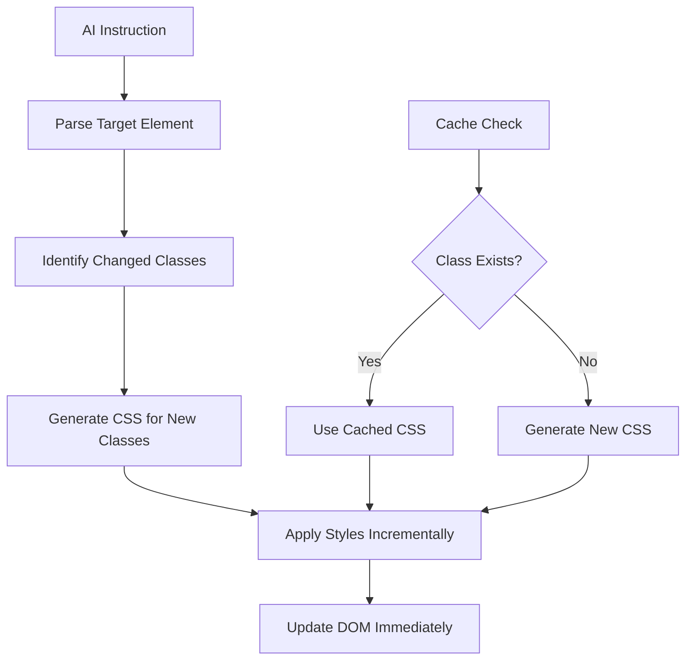

# Partial UI Updates

BaroCSS excels at partial UI updates, allowing AI to modify specific elements or sections without rebuilding entire components. This enables fine-grained control over styling and creates smooth, responsive user experiences.

## Core Concepts

### Incremental Style Application

BaroCSS's incremental parsing ensures that only new or changed classes are processed:



### Smart Class Management

When applying partial updates, BaroCSS intelligently manages class additions, removals, and modifications without affecting unrelated styles.

## Framework-Agnostic Patterns

### Pattern 1: Property-Specific Updates

Update individual CSS properties without affecting others:

```javascript
class PartialStyleUpdater {
    constructor(element) {
        this.element = element;
        this.classMap = this.parseClasses();
    }
    
    parseClasses() {
        const classes = this.element.className.split(' ');
        const map = new Map();
        
        classes.forEach(cls => {
            const property = this.extractProperty(cls);
            if (property) {
                map.set(property, cls);
            }
        });
        
        return map;
    }
    
    extractProperty(className) {
        // Extract property from class name (e.g., 'w-[100px]' -> 'width')
        const propertyMap = {
            'w-': 'width',
            'h-': 'height', 
            'p-': 'padding',
            'm-': 'margin',
            'bg-': 'background',
            'text-': 'color',
            'border-': 'border',
            'rounded-': 'borderRadius',
            'shadow-': 'boxShadow'
        };
        
        for (const [prefix, property] of Object.entries(propertyMap)) {
            if (className.startsWith(prefix)) {
                return property;
            }
        }
        
        return null;
    }
    
    updateProperty(property, value) {
        // Remove existing class for this property
        const existingClass = this.classMap.get(property);
        if (existingClass) {
            this.element.classList.remove(existingClass);
        }
        
        // Add new class with arbitrary value
        const newClass = this.generateClass(property, value);
        this.element.classList.add(newClass);
        this.classMap.set(property, newClass);
    }
    
    generateClass(property, value) {
        const prefixMap = {
            width: 'w',
            height: 'h',
            padding: 'p',
            margin: 'm',
            background: 'bg',
            color: 'text',
            border: 'border',
            borderRadius: 'rounded',
            boxShadow: 'shadow'
        };
        
        const prefix = prefixMap[property];
        return `${prefix}-[${value}]`;
    }
    
    // Update multiple properties atomically
    updateProperties(updates) {
        const classesToRemove = [];
        const classesToAdd = [];
        
        Object.entries(updates).forEach(([property, value]) => {
            const existingClass = this.classMap.get(property);
            if (existingClass) {
                classesToRemove.push(existingClass);
            }
            
            const newClass = this.generateClass(property, value);
            classesToAdd.push(newClass);
            this.classMap.set(property, newClass);
        });
        
        // Batch DOM updates
        this.element.classList.remove(...classesToRemove);
        this.element.classList.add(...classesToAdd);
    }
}

// Usage
const updater = new PartialStyleUpdater(document.getElementById('my-element'));

// Update single property
updater.updateProperty('width', '300px');

// Update multiple properties
updater.updateProperties({
    width: '400px',
    height: '200px',
    background: '#3b82f6',
    borderRadius: '12px'
});
```

### Pattern 2: AI-Guided Micro-Animations

Apply micro-animations to specific elements based on AI instructions:

```javascript
class AIAnimationController {
    constructor() {
        this.activeAnimations = new Map();
        this.defaultDuration = 300;
    }
    
    // Animate specific property changes
    async animateProperty(element, property, fromValue, toValue, options = {}) {
        const {
            duration = this.defaultDuration,
            easing = 'ease-out',
            instruction = 'smooth transition'
        } = options;
        
        const animationId = `${element.id || 'element'}-${property}-${Date.now()}`;
        
        // Parse AI instruction for animation style
        const animationStyle = this.parseAnimationInstruction(instruction);
        
        const startTime = performance.now();
        const startVal = this.parseValue(fromValue);
        const endVal = this.parseValue(toValue);
        
        const animate = (currentTime) => {
            const elapsed = currentTime - startTime;
            const progress = Math.min(elapsed / duration, 1);
            
            const easedProgress = this.applyEasing(progress, animationStyle.easing);
            const currentValue = this.interpolateValue(startVal, endVal, easedProgress);
            
            // Update element with current value
            this.updateElementProperty(element, property, currentValue);
            
            if (progress < 1) {
                this.activeAnimations.set(animationId, requestAnimationFrame(animate));
            } else {
                this.activeAnimations.delete(animationId);
            }
        };
        
        this.activeAnimations.set(animationId, requestAnimationFrame(animate));
        return animationId;
    }
    
    parseAnimationInstruction(instruction) {
        const styles = {
            easing: 'ease-out',
            bounce: false,
            spring: false,
            elastic: false
        };
        
        if (instruction.includes('bounce')) {
            styles.easing = 'bounce';
            styles.bounce = true;
        } else if (instruction.includes('spring')) {
            styles.easing = 'spring';
            styles.spring = true;
        } else if (instruction.includes('elastic')) {
            styles.easing = 'elastic';
            styles.elastic = true;
        } else if (instruction.includes('smooth')) {
            styles.easing = 'ease-out';
        } else if (instruction.includes('sharp')) {
            styles.easing = 'ease-in';
        }
        
        return styles;
    }
    
    applyEasing(progress, type) {
        switch (type) {
            case 'bounce':
                return this.bounceEasing(progress);
            case 'spring':
                return this.springEasing(progress);
            case 'elastic':
                return this.elasticEasing(progress);
            case 'ease-in':
                return progress * progress;
            case 'ease-out':
                return 1 - Math.pow(1 - progress, 3);
            default:
                return progress;
        }
    }
    
    bounceEasing(t) {
        if (t < 1 / 2.75) {
            return 7.5625 * t * t;
        } else if (t < 2 / 2.75) {
            return 7.5625 * (t -= 1.5 / 2.75) * t + 0.75;
        } else if (t < 2.5 / 2.75) {
            return 7.5625 * (t -= 2.25 / 2.75) * t + 0.9375;
        } else {
            return 7.5625 * (t -= 2.625 / 2.75) * t + 0.984375;
        }
    }
    
    springEasing(t) {
        return 1 + Math.sin(t * Math.PI * 3) * Math.exp(-t * 5) * 0.2;
    }
    
    elasticEasing(t) {
        return t === 0 ? 0 : t === 1 ? 1 : 
            -Math.pow(2, 10 * (t - 1)) * Math.sin((t - 1.1) * 5 * Math.PI);
    }
    
    parseValue(value) {
        if (typeof value === 'string') {
            const numericValue = parseFloat(value);
            const unit = value.replace(numericValue.toString(), '');
            return { value: numericValue, unit };
        }
        return { value: parseFloat(value), unit: 'px' };
    }
    
    interpolateValue(start, end, progress) {
        const value = start.value + (end.value - start.value) * progress;
        return `${value}${end.unit}`;
    }
    
    updateElementProperty(element, property, value) {
        const updater = new PartialStyleUpdater(element);
        updater.updateProperty(property, value);
    }
    
    // Chain multiple animations
    async chainAnimations(element, animations) {
        for (const animation of animations) {
            await new Promise(resolve => {
                const animationId = this.animateProperty(
                    element,
                    animation.property,
                    animation.from,
                    animation.to,
                    animation.options
                );
                
                // Wait for animation to complete
                const checkComplete = () => {
                    if (!this.activeAnimations.has(animationId)) {
                        resolve();
                    } else {
                        requestAnimationFrame(checkComplete);
                    }
                };
                checkComplete();
            });
        }
    }
    
    // Parallel animations
    parallelAnimations(element, animations) {
        return Promise.all(
            animations.map(animation =>
                this.animateProperty(
                    element,
                    animation.property,
                    animation.from,
                    animation.to,
                    animation.options
                )
            )
        );
    }
}

// Usage
const animator = new AIAnimationController();

// Single property animation with AI instruction
animator.animateProperty(
    document.getElementById('card'),
    'width',
    '300px',
    '400px',
    { instruction: 'smooth elastic transition', duration: 500 }
);

// Chain multiple animations
animator.chainAnimations(document.getElementById('widget'), [
    {
        property: 'height',
        from: '100px',
        to: '150px',
        options: { instruction: 'spring effect', duration: 300 }
    },
    {
        property: 'background',
        from: '#ffffff',
        to: '#3b82f6',
        options: { instruction: 'smooth fade', duration: 200 }
    }
]);
```

### Pattern 3: Context-Aware Updates

Update elements based on their context and relationships:

```javascript
class ContextAwareUpdater {
    constructor() {
        this.elementContexts = new WeakMap();
        this.observers = new Map();
    }
    
    // Track element context
    registerElement(element, context) {
        this.elementContexts.set(element, {
            ...context,
            lastUpdate: Date.now(),
            changeHistory: []
        });
        
        // Set up mutation observer for this element
        this.observeElement(element);
    }
    
    observeElement(element) {
        const observer = new MutationObserver((mutations) => {
            mutations.forEach(mutation => {
                if (mutation.type === 'attributes' && mutation.attributeName === 'class') {
                    this.handleClassChange(element, mutation.oldValue, element.className);
                }
            });
        });
        
        observer.observe(element, {
            attributes: true,
            attributeOldValue: true,
            attributeFilter: ['class']
        });
        
        this.observers.set(element, observer);
    }
    
    handleClassChange(element, oldClasses, newClasses) {
        const context = this.elementContexts.get(element);
        if (!context) return;
        
        // Record change in history
        context.changeHistory.push({
            timestamp: Date.now(),
            oldClasses,
            newClasses,
            trigger: 'external'
        });
        
        // Analyze change for context-aware adjustments
        this.analyzeAndAdjust(element, context);
    }
    
    analyzeAndAdjust(element, context) {
        const siblings = this.getSiblings(element);
        const parent = element.parentElement;
        
        // Apply contextual adjustments based on AI instructions
        if (context.adjustSiblings) {
            this.adjustSiblings(element, siblings, context.adjustSiblings);
        }
        
        if (context.adjustParent) {
            this.adjustParent(parent, context.adjustParent);
        }
        
        if (context.maintainHarmony) {
            this.maintainVisualHarmony(element, siblings);
        }
    }
    
    getSiblings(element) {
        return Array.from(element.parentElement.children).filter(child => child !== element);
    }
    
    adjustSiblings(element, siblings, instruction) {
        siblings.forEach(sibling => {
            if (instruction.includes('match colors')) {
                this.matchColors(element, sibling);
            }
            
            if (instruction.includes('align heights')) {
                this.alignHeights(element, sibling);
            }
            
            if (instruction.includes('harmonize spacing')) {
                this.harmonizeSpacing(element, sibling);
            }
        });
    }
    
    matchColors(sourceElement, targetElement) {
        const sourceClasses = sourceElement.className.split(' ');
        const colorClass = sourceClasses.find(cls => cls.startsWith('bg-['));
        
        if (colorClass) {
            const targetUpdater = new PartialStyleUpdater(targetElement);
            const colorValue = colorClass.match(/bg-\[([^\]]+)\]/)[1];
            targetUpdater.updateProperty('background', colorValue);
        }
    }
    
    alignHeights(sourceElement, targetElement) {
        const sourceClasses = sourceElement.className.split(' ');
        const heightClass = sourceClasses.find(cls => cls.startsWith('h-['));
        
        if (heightClass) {
            const targetUpdater = new PartialStyleUpdater(targetElement);
            const heightValue = heightClass.match(/h-\[([^\]]+)\]/)[1];
            targetUpdater.updateProperty('height', heightValue);
        }
    }
    
    harmonizeSpacing(sourceElement, targetElement) {
        const sourceClasses = sourceElement.className.split(' ');
        const marginClass = sourceClasses.find(cls => cls.startsWith('m-['));
        
        if (marginClass) {
            const targetUpdater = new PartialStyleUpdater(targetElement);
            const marginValue = marginClass.match(/m-\[([^\]]+)\]/)[1];
            targetUpdater.updateProperty('margin', marginValue);
        }
    }
    
    maintainVisualHarmony(element, siblings) {
        // Analyze color palette
        const colors = this.extractColors([element, ...siblings]);
        
        // Ensure color harmony
        if (colors.length > 3) {
            this.reduceColorComplexity(element, siblings, colors);
        }
        
        // Maintain consistent spacing
        this.normalizeSpacing([element, ...siblings]);
    }
    
    extractColors(elements) {
        const colors = new Set();
        
        elements.forEach(el => {
            const classes = el.className.split(' ');
            classes.forEach(cls => {
                if (cls.startsWith('bg-[#')) {
                    const color = cls.match(/bg-\[([^\]]+)\]/)[1];
                    colors.add(color);
                }
            });
        });
        
        return Array.from(colors);
    }
    
    reduceColorComplexity(element, siblings, colors) {
        // AI-guided color simplification
        const primaryColor = colors[0];
        const accentColor = colors[1];
        
        [element, ...siblings].forEach((el, index) => {
            const updater = new PartialStyleUpdater(el);
            const color = index % 2 === 0 ? primaryColor : accentColor;
            updater.updateProperty('background', color);
        });
    }
    
    normalizeSpacing(elements) {
        const baseSpacing = '16px';
        
        elements.forEach(el => {
            const updater = new PartialStyleUpdater(el);
            updater.updateProperty('margin', baseSpacing);
        });
    }
    
    // AI-driven update with context awareness
    updateWithContext(element, instruction, options = {}) {
        const context = this.elementContexts.get(element);
        if (!context) {
            throw new Error('Element not registered. Call registerElement() first.');
        }
        
        // Parse AI instruction
        const updates = this.parseAIInstruction(instruction, context);
        
        // Apply updates
        const updater = new PartialStyleUpdater(element);
        updater.updateProperties(updates.direct);
        
        // Apply contextual updates
        if (updates.contextual.length > 0) {
            updates.contextual.forEach(update => {
                this.applyContextualUpdate(element, update);
            });
        }
        
        // Record the update
        context.changeHistory.push({
            timestamp: Date.now(),
            instruction,
            updates,
            trigger: 'ai'
        });
    }
    
    parseAIInstruction(instruction, context) {
        const updates = {
            direct: {},
            contextual: []
        };
        
        // Direct style updates
        if (instruction.includes('larger')) {
            updates.direct.width = '400px';
            updates.direct.height = '250px';
        }
        
        if (instruction.includes('blue')) {
            updates.direct.background = '#3b82f6';
        }
        
        if (instruction.includes('rounded')) {
            updates.direct.borderRadius = '12px';
        }
        
        // Contextual updates
        if (instruction.includes('match siblings')) {
            updates.contextual.push({
                type: 'match_siblings',
                properties: ['background', 'height']
            });
        }
        
        if (instruction.includes('stand out')) {
            updates.contextual.push({
                type: 'stand_out',
                intensity: 'high'
            });
        }
        
        return updates;
    }
    
    applyContextualUpdate(element, update) {
        const siblings = this.getSiblings(element);
        
        switch (update.type) {
            case 'match_siblings':
                update.properties.forEach(property => {
                    if (siblings.length > 0) {
                        this[`match${property.charAt(0).toUpperCase() + property.slice(1)}`](siblings[0], element);
                    }
                });
                break;
                
            case 'stand_out':
                this.makeElementStandOut(element, siblings, update.intensity);
                break;
        }
    }
    
    makeElementStandOut(element, siblings, intensity) {
        const updater = new PartialStyleUpdater(element);
        
        if (intensity === 'high') {
            updater.updateProperties({
                boxShadow: '0_20px_60px_rgba(0,0,0,0.3)',
                transform: 'scale(1.1)',
                zIndex: '10'
            });
        } else {
            updater.updateProperties({
                boxShadow: '0_10px_30px_rgba(0,0,0,0.2)',
                transform: 'scale(1.05)',
                zIndex: '5'
            });
        }
    }
    
    cleanup(element) {
        const observer = this.observers.get(element);
        if (observer) {
            observer.disconnect();
            this.observers.delete(element);
        }
        
        this.elementContexts.delete(element);
    }
}

// Usage
const contextUpdater = new ContextAwareUpdater();

// Register elements with context
const card = document.getElementById('main-card');
contextUpdater.registerElement(card, {
    role: 'primary',
    adjustSiblings: 'match colors and align heights',
    maintainHarmony: true
});

// AI-driven contextual update
contextUpdater.updateWithContext(card, 'make it larger and blue, match siblings');
```

## Framework-Specific Implementations

### React Hooks for Partial Updates

```jsx
import { useRef, useCallback, useEffect } from 'react';

function usePartialStyleUpdates(initialClassName = '') {
    const elementRef = useRef(null);
    const updaterRef = useRef(null);
    
    useEffect(() => {
        if (elementRef.current) {
            updaterRef.current = new PartialStyleUpdater(elementRef.current);
        }
    }, []);
    
    const updateProperty = useCallback((property, value) => {
        if (updaterRef.current) {
            updaterRef.current.updateProperty(property, value);
        }
    }, []);
    
    const updateProperties = useCallback((updates) => {
        if (updaterRef.current) {
            updaterRef.current.updateProperties(updates);
        }
    }, []);
    
    const animateProperty = useCallback((property, fromValue, toValue, options) => {
        if (elementRef.current) {
            const animator = new AIAnimationController();
            return animator.animateProperty(elementRef.current, property, fromValue, toValue, options);
        }
    }, []);
    
    return {
        elementRef,
        updateProperty,
        updateProperties,
        animateProperty
    };
}

// Usage in React component
function AIEditableCard({ title, content }) {
    const { elementRef, updateProperty, animateProperty } = usePartialStyleUpdates(
        'w-[320px] h-[200px] bg-white rounded-[8px] p-[16px]'
    );
    
    const handleAIInstruction = async (instruction) => {
        if (instruction.includes('wider')) {
            await animateProperty('width', '320px', '400px', { 
                instruction: 'smooth expansion',
                duration: 300 
            });
        }
        
        if (instruction.includes('colorful')) {
            updateProperty('background', '#ff6b6b');
        }
    };
    
    return (
        <div ref={elementRef}>
            <h3>{title}</h3>
            <p>{content}</p>
            <button onClick={() => handleAIInstruction('make it wider and colorful')}>
                AI Transform
            </button>
        </div>
    );
}
```

### Vue Composition API

```javascript
import { ref, onMounted, onUnmounted } from 'vue';

export function usePartialUpdates() {
    const elementRef = ref(null);
    const updater = ref(null);
    const animator = ref(null);
    
    onMounted(() => {
        if (elementRef.value) {
            updater.value = new PartialStyleUpdater(elementRef.value);
            animator.value = new AIAnimationController();
        }
    });
    
    const updateProperty = (property, value) => {
        if (updater.value) {
            updater.value.updateProperty(property, value);
        }
    };
    
    const animateProperty = async (property, from, to, options) => {
        if (animator.value && elementRef.value) {
            return animator.value.animateProperty(
                elementRef.value, 
                property, 
                from, 
                to, 
                options
            );
        }
    };
    
    onUnmounted(() => {
        if (animator.value) {
            animator.value.cancelAllAnimations();
        }
    });
    
    return {
        elementRef,
        updateProperty,
        animateProperty
    };
}
```

Partial UI updates with BaroCSS enable precise, efficient styling modifications that respond immediately to AI instructions, creating fluid and responsive user experiences without any build process.
