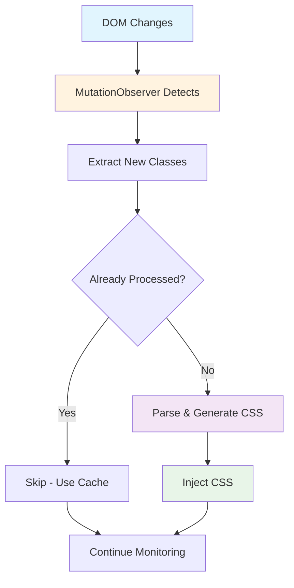

# Automatic DOM Change Detection

BaroCSS features an intelligent DOM change detection system that automatically monitors your page for new CSS classes and generates styles instantly, without any manual intervention.

## What is DOM Change Detection?

DOM change detection is the process of automatically monitoring your webpage for changes and processing new CSS classes as they appear. BaroCSS uses this to provide real-time styling without build processes.

## How It Works



## Key Features

### 1. Automatic Monitoring

::: details Purpose
BaroCSS automatically watches for DOM changes using the native MutationObserver API.
:::

No manual configuration required - just start the runtime and BaroCSS handles everything automatically.

### 2. Real-time Processing

::: details Purpose
New classes are processed and CSS is generated instantly as they appear in the DOM.
:::

When new elements are added or class attributes change, BaroCSS immediately processes the new classes and injects the corresponding CSS.

### 3. Intelligent Caching

::: details Purpose
Already processed classes are skipped to avoid redundant work.
:::

The system tracks which classes have been processed and reuses cached results for better performance.

## Basic Setup

```typescript
import { BrowserRuntime } from '@barocss/browser';

const runtime = new BrowserRuntime();

// Monitor entire document
runtime.observe(document.body, { scan: true });
```

::: details Configuration Options
- `scan: true` - Enables automatic scanning of existing classes in the element
- `onReady?: () => void` - Callback function called when initial scan is complete

The MutationObserver automatically monitors:
- Class attribute changes on existing elements
- New elements being added to the DOM  
- Changes in child elements (subtree)
:::

## Benefits

- **Zero Configuration** - Works out of the box without any setup
- **Real-time Updates** - CSS generated instantly as classes appear
- **Performance Optimized** - Smart caching and efficient processing
- **Automatic Detection** - No manual class registration required

## Conclusion

Automatic DOM change detection is one of BaroCSS's most powerful features, enabling truly dynamic CSS generation without any manual configuration or build processes.

The system intelligently monitors your page, processes only new classes, and provides excellent performance through smart caching and batching.

::: tip Ready to Get Started?
Check out the [Installation Guide](/guide/installation) to start using BaroCSS with automatic DOM change detection.
:::