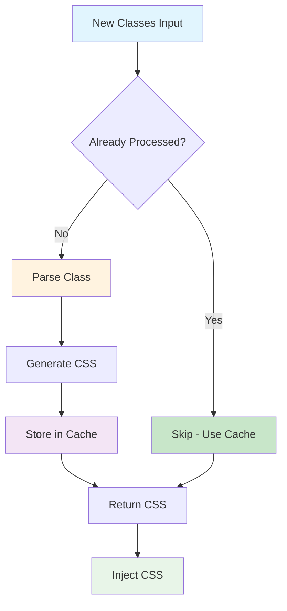
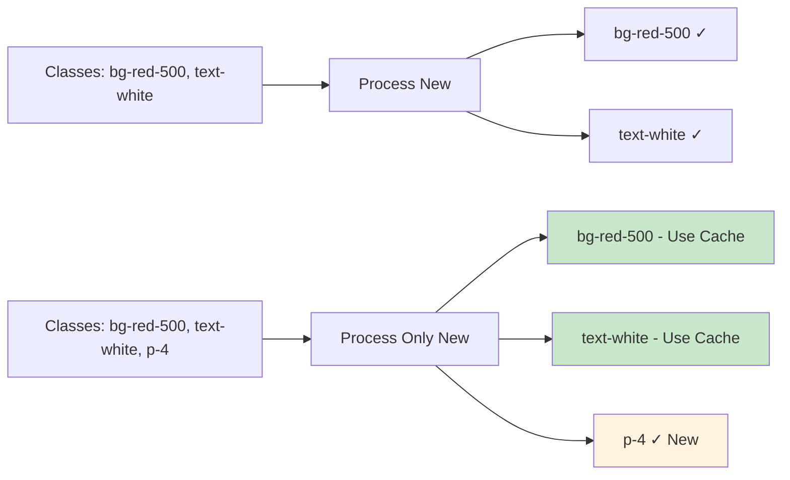

# Incremental Parsing System

BaroCSS features a sophisticated incremental parsing system that processes CSS classes efficiently, avoiding redundant work and providing optimal performance for large applications.

## What is Incremental Parsing?

Incremental parsing is a performance optimization technique that processes only new or changed data, rather than reprocessing everything from scratch. In BaroCSS, this means:

- **Track processed classes** to avoid duplicate work
- **Batch multiple operations** for better performance  
- **Support both sync and async** processing modes
- **Optimize memory usage** with intelligent caching

## How Incremental Parsing Works



## How BaroCSS Incremental Parsing Works

::: tip Smart Processing
BaroCSS only processes new classes, reusing cached results for previously processed classes.
:::



**Key Benefits:**
- Only processes new classes
- Reuses cached results
- Scales efficiently with large class counts

## Key Features

### 1. Class Tracking

::: details Purpose
BaroCSS maintains a registry of processed classes to avoid redundant work.
:::

The system tracks which classes have been processed and skips them on subsequent requests, using cached results instead.

### 2. Batch Processing

::: details Purpose
Process multiple classes efficiently in optimal batches for better performance.
:::

Instead of processing classes one by one, BaroCSS groups them into batches and processes them together, reducing overhead and improving efficiency.

### 3. Async Processing Support

::: details Purpose
Handle large numbers of classes without blocking the main thread.
:::

For applications with many classes, BaroCSS can process them asynchronously, ensuring smooth user experience even during heavy CSS generation.

## Use Cases

### 1. Large Applications

Perfect for applications with many dynamic classes:

- **Component libraries** with hundreds of utility combinations
- **Dynamic theming** systems that change classes frequently
- **User-generated content** with custom styling

### 2. Dynamic Content

Ideal for content that changes frequently:

- **Real-time editors** where users add/remove classes
- **Interactive dashboards** with dynamic widgets
- **E-commerce sites** with product-specific styling

### 3. Performance-Critical Applications

Essential for applications where performance matters:

- **Mobile applications** with limited resources
- **Large-scale web apps** with thousands of components
- **Real-time applications** requiring smooth interactions

## Benefits

### Memory Efficiency

::: tip Smart Caching
BaroCSS uses multi-layer caching to store results at each processing stage.
:::

- **Parse Cache** - Stores parsed class structures
- **AST Cache** - Stores generated Abstract Syntax Trees  
- **CSS Cache** - Stores final CSS output
- **Reduced memory footprint** - Only stores unique class results
- **Faster access** - Cached results are retrieved instantly
- **Lower garbage collection** - Fewer temporary objects created

### CPU Optimization

::: tip Intelligent Processing
Only new classes require CPU-intensive parsing and CSS generation.
:::

- **Faster initial loads** - Processes only what's needed
- **Efficient updates** - Skips already-processed classes
- **Better scalability** - Performance doesn't degrade with class count

### Developer Experience

::: tip Seamless Integration
Works automatically without additional configuration.
:::

- **Zero configuration** - Works out of the box
- **Transparent operation** - No changes to existing code
- **Consistent performance** - Predictable behavior across applications

## Integration

### Browser Runtime

Incremental parsing is automatically enabled in the browser runtime:

```typescript
import { BrowserRuntime } from '@barocss/browser';

const runtime = new BrowserRuntime();
// Incremental parsing is automatically active
```

### Server Runtime

Server-side applications also benefit from incremental parsing:

```typescript
import { ServerRuntime } from '@barocss/server';

const runtime = new ServerRuntime();
// Efficient processing for SSR applications
```

## Conclusion

Incremental parsing is a key differentiator of BaroCSS, providing significant performance improvements for applications with dynamic content and large numbers of CSS classes.

The system intelligently tracks processed classes, batches operations efficiently, and provides seamless integration with both browser and server runtimes.

::: tip Ready to Learn More?
Check out the [Engine API](/api/engine) for detailed implementation examples and advanced usage patterns.
:::