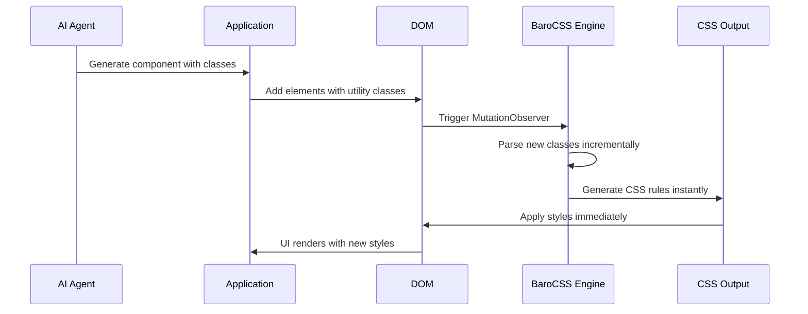

# Build-free UI Generation

BaroCSS enables true build-free UI generation by processing CSS classes in real-time as they're dynamically added to the DOM. This makes it perfect for AI-driven development where UI components are generated on-demand without any compilation step.

## How Build-free Works

Unlike traditional utility-first frameworks that require a build step to scan and generate CSS, BaroCSS processes classes at runtime:



## Quick Start (Vanilla HTML)

```html
<script src="https://unpkg.com/@barocss/browser@0.0.3/dist/cdn/barocss.umd.cjs"></script>
<script>
  const runtime = new BaroCSS.BrowserRuntime()
  runtime.observe(document.body, { scan: true })
</script>
```

## Quick Start (ESM)

```html
<script type="module">
  import { BrowserRuntime } from 'https://unpkg.com/@barocss/browser@0.0.3/dist/cdn/barocss.js'
  const runtime = new BrowserRuntime()
  runtime.observe(document.body, { scan: true })
</script>
```

## Key Benefits

### 1. Zero Build Time
No compilation or build process required. CSS is generated instantly as classes are discovered.

### 2. Dynamic Class Support
BaroCSS can process supported arbitrary values when classes appear in the DOM. Test each class pattern that your app generates; the [compatibility scope](/guide/compatibility) covers only a small sample.

### 3. Incremental Processing
Only new or changed classes are processed, ensuring optimal performance.

### 4. Memory Efficient
Smart caching system prevents redundant processing of previously seen classes.

## Real-time Class Processing

The browser runtime can process new elements after they enter the observed DOM. This example uses classes from the selected compatibility fixtures:

```javascript
const message = document.createElement('p')
message.className = 'block text-center bg-red-500'
message.textContent = 'New content'
document.body.appendChild(message)
```

## Performance Characteristics

### Smart Caching Layers

BaroCSS employs multiple caching layers to ensure optimal performance:

1. **AST Cache**: Parsed abstract syntax trees
2. **Parse Result Cache**: Processed class results  
3. **Utility Cache**: Generated CSS utilities
4. **Failure Cache**: Invalid classes (prevents reprocessing)

### Memory Management

Some core caches limit their entry count and remove the oldest inserted entry when full. This is insertion-order eviction, not a measured memory guarantee.

### Processing speed

The site has no reproducible browser benchmark for parse time, cache lookup time, or DOM mutation latency. Measure these operations in your application before setting a performance budget.

## Framework Integration

Build-free UI generation works seamlessly with any framework:

- **Vanilla HTML/JS**: Direct DOM manipulation
- **React**: Component state updates
- **Vue**: Reactive data changes
- **Svelte**: Store updates
- **SolidJS**: Signal changes
- **jQuery**: Dynamic content insertion

## AI Integration Patterns

### Pattern 1: Direct Component Generation

```javascript
// AI generates complete components
const generateComponent = async (prompt) => {
  const aiResponse = await aiService.generateComponent(prompt);
  
  // BaroCSS processes these classes automatically
  return `
    <div class="${aiResponse.containerClasses}">
      <h2 class="${aiResponse.titleClasses}">${aiResponse.title}</h2>
      <p class="${aiResponse.contentClasses}">${aiResponse.content}</p>
    </div>
  `;
};
```

### Pattern 2: Style Modification

```javascript
// AI modifies existing styles
const modifyElementStyles = async (element, instruction) => {
  const currentClasses = element.className;
  const newClasses = await aiService.modifyClasses(currentClasses, instruction);
  
  // BaroCSS automatically handles the class changes
  element.className = newClasses;
};
```

### Pattern 3: Partial Updates

```javascript
// AI updates specific style properties
const updateProperty = async (element, property, value) => {
  const aiClasses = await aiService.generateProperty(property, value);
  
  // Add new classes while keeping existing ones
  element.classList.add(...aiClasses.split(' '));
};
```

 

 
