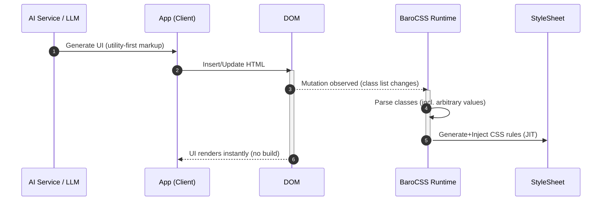

# Integration Overview

BaroCSS enables real-time rendering of utility-first markup (Tailwind-style syntax) with zero build steps. This page combines the overall AI → DOM → BaroCSS flow and the build‑free generation details.

## Flow Overview

- AI (or your app) produces markup with utility classes
- Your app injects the markup into the DOM
- BaroCSS observes DOM changes and generates CSS instantly



## Minimal Setup

```ts
import { BrowserRuntime } from '@barocss/browser'

// 1) Initialize runtime once
const runtime = new BrowserRuntime({
  config: {}
})

// 2) Observe the document (scan + watch)
runtime.observe(document.body, { scan: true })
```

## Quick Start (Vanilla HTML)

```html
<script src="https://unpkg.com/@barocss/browser@latest/dist/cdn/barocss.umd.cjs"></script>
<script>
  const runtime = new BaroCSS.BrowserRuntime()
  runtime.observe(document.body, { scan: true })
</script>
```

## Quick Start (ESM)

```html
<script type="module">
  import { BrowserRuntime } from 'https://unpkg.com/@barocss/browser@latest/dist/cdn/barocss.js'
  const runtime = new BrowserRuntime()
  runtime.observe(document.body, { scan: true })
</script>
```

## Real‑time Class Processing

```js
// Example: AI returns a component using Tailwind-style syntax
const aiComponent = `
  <div class="flex items-center justify-between p-[1.5rem] bg-white rounded-[0.75rem]
              shadow-[0_4px_6px_-1px_rgba(0,0,0,0.1)] w-[400px] h-[120px]">
    <h2 class="text-[1.25rem] font-semibold text-gray-800 leading-[1.4]">AI Generated</h2>
    <button class="px-[1rem] py-[0.5rem] bg-blue-500 text-white rounded-[0.375rem]
                    hover:bg-blue-600 transition-colors duration-[200ms] w-[120px]">
      Action
    </button>
  </div>
`

// Insert into the DOM
const mount = document.getElementById('app')
mount.innerHTML = aiComponent
// BaroCSS detects the change and generates CSS instantly (no build step)
```

## Arbitrary Values

BaroCSS parses arbitrary values (e.g., `w-[420px]`, `rotate-[5deg]`, `shadow-[...]`) at runtime, enabling precise, data‑driven styles.

```ts
function renderAICard(data: { color: string; title: string; description: string }) {
  const { color, title, description } = data
  return `
    <div class="bg-${color}-50 border-l-[4px] border-${color}-500 p-[1rem]
                rounded-r-[0.5rem] shadow-[0_4px_6px_-1px_rgba(0,0,0,0.1)]
                w-[420px] h-[160px]">
      <h3 class="text-[1rem] font-medium text-${color}-800 mb-[0.25rem]">${title}</h3>
      <p class="text-[0.875rem] text-${color}-700 leading-[1.5]">${description}</p>
    </div>
  `
}
```