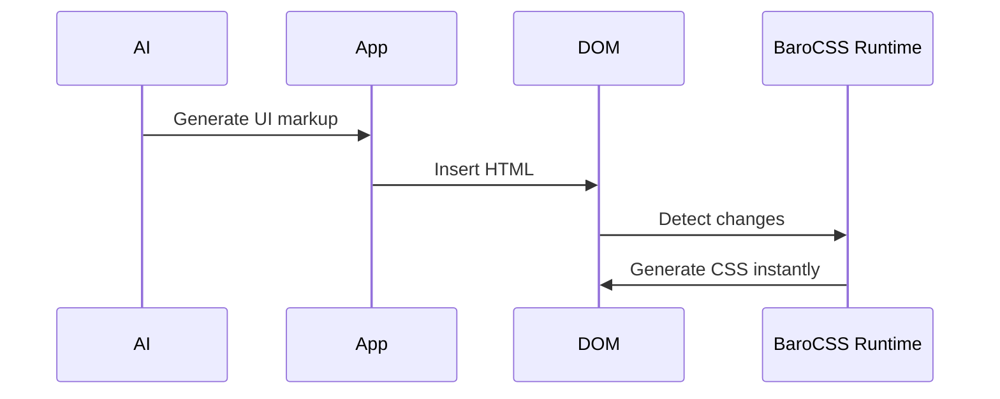

## Why Choose BaroCSS?

BaroCSS is a **next-generation CSS runtime** designed to bring Tailwind's powerful utility-first approach to real-time development. We've built a completely new parser from the ground up to support the full Tailwind syntax in the browser, eliminating build processes while maintaining all the performance benefits of JIT compilation.

### The Future of CSS Development

**Traditional Approach:**
```bash
# Write CSS classes → Build process → Wait → See changes
<div class="bg-blue-500 hover:bg-blue-700">Button</div>
# 30+ seconds of build time...
```

**BaroCSS Approach:**
```bash
# Write CSS classes → Instant results
<div class="bg-blue-500 hover:bg-blue-700">Button</div>
# 0ms - CSS generated instantly!
```

### Built for AI-Driven Development

BaroCSS is architected for the future where AI generates UI components. When AI creates utility-first interfaces using Tailwind syntax, BaroCSS ensures they render instantly without any build steps:

```typescript
// AI generates this component with arbitrary values
const component = `
<div class="flex items-center justify-between p-[1.5rem] bg-white rounded-[0.75rem] shadow-[0_4px_6px_-1px_rgba(0,0,0,0.1)] w-[400px] h-[120px]">
  <h2 class="text-[1.25rem] font-semibold text-gray-800 leading-[1.4]">AI Generated Card</h2>
  <button class="px-[1rem] py-[0.5rem] bg-blue-500 text-white rounded-[0.375rem] hover:bg-blue-600 transition-colors duration-[200ms] w-[120px]">
    Action
  </button>
</div>
`;

// BaroCSS parses arbitrary values like w-[400px], p-[1.5rem] instantly!
// No build process needed - pure JIT magic in real-time!
```

### AI Integration Flow



- AI generates utility-first markup (Tailwind syntax supported)
- App injects markup into the DOM
- `BrowserRuntime` observes changes and generates CSS in real time

See the full guide: [AI Integration](/guide/ai-integration)

### Get Started in Minutes

```bash
# Install BaroCSS
npm install @barocss/kit

# Import and start using
import { BrowserRuntime } from '@barocss/kit/runtime/browser';

const runtime = new BrowserRuntime();
runtime.observe(document.body, { scan: true });
// Start generating CSS instantly!
```

Ready to experience the future of CSS development? [Get started now](/guide/) or explore our [examples](/examples/).
