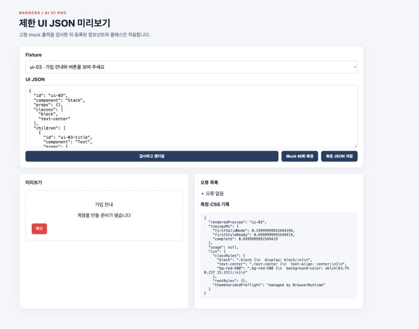
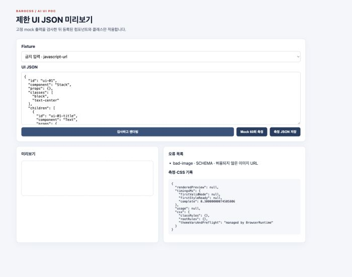

# AI UI PoC: 결정적 mock 단계 결과

기록일: 2026-09-23. PoC 브랜치는 0.0.4 후보 PR [#71](https://github.com/barocss/barocss/pull/71)의 `533fdb1` 위에 있다. 이 결과는 릴리스 후보의 판정에 포함하지 않는다. 기술 배경은 [AI UI Discussion #69](https://github.com/barocss/barocss/discussions/69)와 연구 문서에 있다. PoC Issue는 게시 전 초안이다.

## 구현 범위

고정 mock UI JSON → 엄격한 스키마·크기 검사 → 5개 허용 컴포넌트 렌더 → 허용한 BaroCSS 클래스의 CSS 생성·적용 → 노드별 오류 목록을 구현했다. `@barocss/kit`의 `generateCssRules`로 각 클래스의 CSS를 확인하고 `@barocss/browser`의 `BrowserRuntime.addClass`로 적용한다. 클래스 규칙과 root 규칙은 따로 기록한다. 런타임의 테마 변수·preflight는 별도 관리 항목으로 표시한다.

자유 HTML·JS·임의 CSS·동적 import·사용자 코드 실행은 입력 계약에 없다. 텍스트는 텍스트 노드로 넣고, 이미지 출처는 포함된 파일 하나로 제한한다. 실제 모델 공급자, 키, 모델 비용과 서버 검증 경계는 PM 결정 뒤의 단계다. `json-render`는 자체 카탈로그와 클래스 배열 접점만 별도로 비교할 계획이며 아직 연결하지 않았다.

## 재현 자료와 관측값

| 항목 | 결과 |
| --- | --- |
| 정상 입력 | [20개 고정 fixture](../apps/ai-ui-poc/fixtures/benchmark.js) × 3회 = 60회 |
| 금지 입력 | [10개 fixture](../apps/ai-ui-poc/fixtures/forbidden.js) 각각 오류 발생. 위험 클래스 3개는 제외하고 안전한 노드만 표시. 다른 구조 오류 7개는 트리 전체를 거부. |
| 스키마 유효성 | 60/60 |
| 구조·텍스트 검사 | 60/60. 노드 ID·태그·클래스·자식 순서·텍스트와 이미지 속성을 fixture 트리와 대조. 반응형 viewport 검사는 포함하지 않음. |
| 루트 계산 스타일·가시성 확인 | 60/60. 모든 정상 fixture의 루트 `text-center`에 대해 `text-align: center`와 가시성만 자동 검사. |
| 추가 계산 스타일 검사 | 60/60회에서 지정한 검사 90건 통과. 루트 `text-center`, 카드 `overflow-hidden`, 버튼의 `block`·`bg-red-500`만 확인. |
| `firstStyleReady` p95 | 0.7ms, 위 루트 검사까지의 시간. 동일 페이지의 따뜻한 캐시에서 측정. 모델·네트워크·paint 시간은 제외. |
| 브라우저 | Chromium 153, 1280px viewport. Fixture의 `mobile` 값은 의도 표식이며 화면 크기를 바꾸지 않음. |

각 실행의 시간, 오류, fixture ID, 의도 viewport, 실제 viewport와 검사별 결과는 [원시 JSON](../apps/ai-ui-poc/results/mock-60.json)에 있다. 현재 mock의 `firstValidNode`는 전체 트리 검증이 끝난 시각이다. 부분 스트림의 첫 노드 시각은 측정하지 않았다. 기본 `div`·`p`의 `block`은 해당 요소의 기본 표시 방식만으로 통과할 수 있어 추가 스타일 검사에서 제외했다. `grid-cols-2`와 `md:block`의 의미도 이 실행에서 검사하지 않았다. 정상 화면의 오류 목록은 비어 있었다. 10개 금지 입력을 브라우저에서 각각 선택해 오류 코드와 미리보기 상태를 확인했다. 금지 이미지 입력은 이미지 노드를 만들지 않았다.

검사 명령: Node 22.22.0, pnpm 9.15.4에서 `pnpm install --frozen-lockfile`, `pnpm check`, `pnpm --filter @barocss/ai-ui-poc build`가 통과했다. 그 뒤 PoC의 여섯 개 Node 테스트와 빌드를 다시 실행해 통과했다. 추가한 테스트 두 개는 Stack·Card와 미리보기 루트의 예상 밖 텍스트 노드를 구조 검사에서 거부한다. 기존 browser lint 경고 2개는 남아 있다. lockfile 변경은 새 앱 importer 9줄뿐이다.

Guard는 이전 PoC 코드 커밋 `a487c46`을 [독립 검사](https://github.com/barocss/barocss/pull/74#issuecomment-5787986716)했다. 별도 보관본에서 고정 설치, `pnpm check`, PoC 빌드가 통과했다. Chromium 153의 개발 서버와 프로덕션 빌드에서 20개 fixture를 3회씩 재실행해 당시의 스키마·구조/텍스트·루트 계산 스타일 검사가 60/60이고 오류가 0건임을 확인했다. 금지 입력 10종은 모두 예상 오류가 났다. 구조 오류 7종의 미리보기는 비었고, 위험 클래스 3종은 해당 클래스만 제거됐다. 금지 입력 실행 중 스크립트 노드와 허용 외 네트워크 요청은 관측되지 않았다. Guard의 개발 서버 재실행 p95는 0.5ms, 프로덕션 빌드 재실행은 0.6ms였다. 지연값의 결정성을 주장하지 않는다. Guard는 후속 코드 `644706e`에서 [컨테이너에 추가한 텍스트가 통과하는 결함](https://github.com/barocss/barocss/pull/74#issuecomment-5788402422)을 재현했다. 자식 노드 전체를 대조하도록 고치고 회귀 테스트를 추가했다. Guard는 수정 커밋 `dd3e58e`를 [별도 보관본에서 재검증](https://github.com/barocss/barocss/pull/74#issuecomment-5788464045)했다. 고정 설치, PoC 테스트 6/6, 빌드가 통과했다. 추가 텍스트는 구조·스타일 검사 모두 실패했고, 정상 mock 60회는 구조·스타일 60/60, 지정 스타일 90건, 오류 0건이었다. 재실행 p95는 저장 기록과 같은 0.7ms였다.

Guard는 PoC `14c25dc`와 기준 PR #71 `6df9af9` 사이의 네 커밋도 [임시 결합 트리에서 검사](https://github.com/barocss/barocss/pull/74#issuecomment-5788985435)했다. kit engine 테스트 32/32, PoC 테스트 6/6, PoC 빌드가 통과했다. 기본 context에서 허용 클래스 9개의 `generateCssRules()` CSS·rootCss는 후보 차이 적용 전후 바이트 단위로 같았다. 이 검사는 기존 `node_modules`를 사용했으며 새 고정 설치, 브라우저 재실행, 전체 suite, pack은 포함하지 않았다. #71 병합 뒤 `develop` 기준 변경 범위와 CI·Guard 판정은 별도로 필요하다.

## 실행 화면 증거

2026-09-23에 코드 커밋 `b55e487`을 로컬 개발 서버에서 실행했다. Node 22.22.0, pnpm 10.11.0에서 `pnpm --filter @barocss/ai-ui-poc test`는 6/6 통과했고 `pnpm --filter @barocss/ai-ui-poc build`도 통과했다. `pnpm --filter @barocss/ai-ui-poc dev --host 127.0.0.1 --port 5174`로 연 Chromium 153의 실제 viewport 너비는 1280px이었다. 아래 이미지는 해당 화면의 왼쪽 700×550px을 잘라 저장했다. 이미지는 고정 mock 입력을 사용하며 모델 출력을 보여 주지 않는다.

정상 입력 [ui-03](../apps/ai-ui-poc/fixtures/benchmark.js)은 제목·안내·`Button`과 `block`, `text-center`, `bg-red-500` 클래스를 요구한다. 예상 결과는 세 요소 렌더와 빈 오류 목록이다. 실제로 세 요소가 보였고 오류는 없었다. 계산 스타일은 루트 `text-align: center`, 버튼 `display: block`, 배경색 `oklch(0.637 0.237 25.331)`이었다. 화면 오른쪽 CSS 기록에도 해당 클래스 규칙이 표시됐다.

금지 입력 [javascript-url](../apps/ai-ui-poc/fixtures/forbidden.js)은 이미지 출처 `javascript:alert(1)`을 포함한다. 예상 결과는 트리 거부와 이미지 미생성이다. 실제 미리보기 자식 요소와 이미지 수는 모두 0이었고, 오류 목록에 `bad-image · SCHEMA · 허용되지 않은 이미지 URL`이 표시됐다.

이 두 화면은 UI 상태와 지정 계산 스타일의 예시다. 이미지 자체로 60회 측정, 브라우저의 paint 시각, 모바일 viewport, `grid-cols-2`·`md:block`의 스타일 의미, 실제 모델 품질·비용을 증명하지 않는다. 이 항목은 위 원시 기록과 측정 계약의 범위에 따라 따로 판단해야 한다.

## 측정 계약: 실제 모델 단계

아래 기준은 사전 목표다. 이 mock 결과를 실제 모델의 성공률이나 비용으로 쓰지 않는다.

1. 같은 20개 프롬프트를 모델 한 버전에서 각 3회 실행한다. 입력 ID, 모델·버전, BaroCSS 커밋·패키지 버전, Tailwind 비교 버전, 브라우저·기기·실제 viewport, 네트워크 조건을 저장한다. 실패 원본도 남긴다.
2. 실제 모델 단계에서 `firstValidNode`는 첫 완전 검증 노드 수신, `firstStyleReady`는 사전에 지정한 노드·클래스별 예상 계산 스타일과 가시성이 처음 확인된 시각, `complete`는 마지막 유효 노드 적용 시각이다. 60개 값을 정렬한 57번째 값을 p95로 쓴다. 실제 paint는 별도 스크린샷과 화면 검사로 확인한다. 지연 시험은 전경 탭에서 한다.
3. 스키마 유효 출력 57/60 이상, 주요 구조·텍스트·반응형 검사 48/60 이상, `firstStyleReady` p95 3초 이하를 목표로 둔다. CSS 미지원·거부 클래스는 100% 오류로 남긴다. 금지 입력 10개는 스크립트 실행과 허용 외 네트워크 요청 없이 차단한다.
4. 매 실행의 입력·출력 토큰과 적용 단가·조회일, USD 추정값을 기록한다. 모델이나 가격이 정해지기 전에는 값을 만들지 않는다. 모델 스키마, 클래스 정책, CSS 미지원, 렌더러, 네트워크, 모델 서비스를 실패 원인으로 구분한다.
5. Tailwind 기준은 Mirror의 [4.1.13 고정 표본](../packages/barocss/docs/tailwind-compatibility.md)이다. 임시 결합 트리의 15개 입력은 CSS 구조 일치 8개, 구조 차이 7개, 빈 BaroCSS 규칙 0개다. 이는 전체 호환율이나 최종 통합 결과가 아니다. PoC 정상 fixture에서 쓴 `block`, `text-center`, `overflow-hidden`, `bg-red-500`, `grid-cols-2`, `md:block`은 매트릭스 입력과 겹친다. 그러나 PoC의 기본 테마 색과 매트릭스의 고정 테스트 테마 색은 다르며, 이 PoC는 Tailwind와 출력 CSS를 직접 비교하지 않았다. `grid-cols-2`, `md:block`의 계산 스타일과 모바일·데스크톱 화면 검사도 후속 측정이다. BaroCSS 전용 문법을 추가하면 Tailwind 호환 집계와 분리해 출처를 기록한다.

## 다음 결정

PM은 첫 모델 공급자, 데이터 처리 조건, 비용 상한, 서버 검증 위치를 정해야 한다. Mirror는 PoC 허용 클래스의 CSS 의미와 반응형 조건을 더 확인해야 한다. Guard의 mock 독립 검증은 완료됐다. 실제 모델 어댑터와 `json-render` 비교는 위 결정 뒤에 추가한다.
