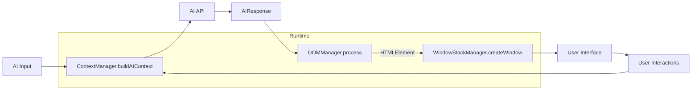

# @barocss/ui

Utilities and runtime managers for building AI-driven UIs with BaroCSS.

## ✨ What’s inside

- DOMManager: Parse AI responses (HTML + display config) into real DOM
- WindowStackManager: Create/focus/minimize/maximize/close windows with z-index handling
- ContextManager: Track conversation, workflow state, and build AI context snapshots
- Typed core models: `AIResponse`, `DisplayConfig`, `WindowConfig`, `WindowInstance`, etc.

## 📦 Install

```bash
pnpm add @barocss/ui@latest
```

## 🚀 Quick start

Render an AI response and register it as a window:

```ts
import { DOMManager, WindowStackManager, type AIResponse } from '@barocss/ui';

const dom = new DOMManager();
const windows = new WindowStackManager();

const aiResponse: AIResponse = {
  html: '<div id="user-table" class="window w-[720px] h-[420px] bg-white rounded-xl shadow-lg">Hello</div>',
  display: { type: 'window', size: 'large', position: 'center', priority: 'normal', backdrop: 'none' },
  context: { id: 'user-table', parent: null, purpose: 'general', workflow: null },
  interactions: {},
  effects: { entrance: 'fadeIn', exit: 'fadeOut', duration: 300 }
};

const result = await dom.process(aiResponse);
if (result.success && result.element) {
  document.body.appendChild(result.element);
  windows.createWindow(result.element, { type: 'window', size: 'large', draggable: true, resizable: true });
}
```

Build AI context for the next turn:

```ts
import { ContextManager } from '@barocss/ui';

const ctx = new ContextManager();

// later, after windows are created
const current = windows.getActiveWindows();
const focused = windows.getFocusedWindow()?.id ?? null;

const aiContext = ctx.buildAIContext('show more details', current, focused);
```

## 📈 Diagram



## 🧩 API overview

### UIRuntime (Main Orchestrator)

- `processUserInput(input: string): Promise<OrchestrateResult>`
- `dom: DOMManager` - Direct access to DOM manager
- `windows: WindowStackManager` - Direct access to window manager  
- `context: ContextManager` - Direct access to context manager

### DOMManager

- `process(aiResponse: AIResponse): Promise<ProcessResult>`
- `remove(elementId: string): Promise<boolean>`
- `update(elementId: string, newAIResponse: AIResponse): Promise<ProcessResult>`

### WindowStackManager

- `createWindow(element: HTMLElement, config: WindowConfig): WindowInstance`
- `focusWindow(windowId: string): void`
- `minimizeWindow(windowId: string): void`
- `maximizeWindow(windowId: string): void`
- `closeWindow(windowId: string): void`
- `getActiveWindows(): WindowInstance[]`
- `getWindowById(id: string): WindowInstance | null`
- `getFocusedWindow(): WindowInstance | null`
- `getStats(): { totalWindows: number; focusedWindowId: string | null }`

### ContextManager

- `addConversation(entry: ConversationEntry): void`
- `getConversationHistory(count?: number): ConversationEntry[]`
- `updateWorkflowState(stage: WorkflowStage, data: Partial<WorkflowState>): void`
- `getCurrentWorkflow(): WorkflowState | null`
- `captureSnapshot(active?: WindowInstance[], focusedId?: string | null): ContextSnapshot`
- `buildAIContext(userInput: string, active?: WindowInstance[], focusedId?: string | null): AIContext`

## ⚙️ Configuration

### Layout Policy

```ts
const runtime = new UIRuntime({
  ai: myAIService,
  layoutPolicy: {
    positioningStrategy: 'cascade', // 'center' | 'cascade' | 'beside-parent' | 'overlay-parent' | 'smart'
    cascadeOffset: 30,
    zIndexBase: 1000,
    zIndexLayers: {
      base: 0,
      layout: 100,
      content: 200,
      floating: 300,
      modal: 400,
      overlay: 500
    }
  }
});
```

### Error Policy

```ts
const runtime = new UIRuntime({
  ai: myAIService,
  errorPolicy: {
    showUserFriendlyErrors: true,
    fallbackUI: (error) => {
      const div = document.createElement('div');
      div.className = 'error-fallback p-4 bg-red-50 border border-red-200 rounded-lg';
      div.innerHTML = `<h3>오류 발생</h3><p>${error.message}</p>`;
      return div;
    },
    logLevel: 'error' // 'silent' | 'error' | 'warn' | 'info' | 'debug'
  }
});
```

## 🔠 Core types (summary)

```ts
type DisplayType = 'window' | 'modal' | 'overlay' | 'inline' | 'embedded';
type WindowSize = 'small' | 'medium' | 'large' | 'fullscreen' | 'auto';
type Priority = 'low' | 'normal' | 'high' | 'critical';

interface DisplayConfig {
  type: DisplayType;
  size: WindowSize;
  position?: 'center' | 'beside-parent' | 'overlay-parent' | 'smart';
  priority?: Priority;
  backdrop?: 'none' | 'blur' | 'dim';
}

interface AIResponse {
  html: string;
  display: DisplayConfig;
  context: { id: string; parent?: string | null; purpose?: string | null; workflow?: string | null };
  interactions?: Record<string, unknown>;
  effects?: { entrance?: string; exit?: string; duration?: number };
}
```

## Scripts

- build: Build the library to `dist`

## License

MIT
