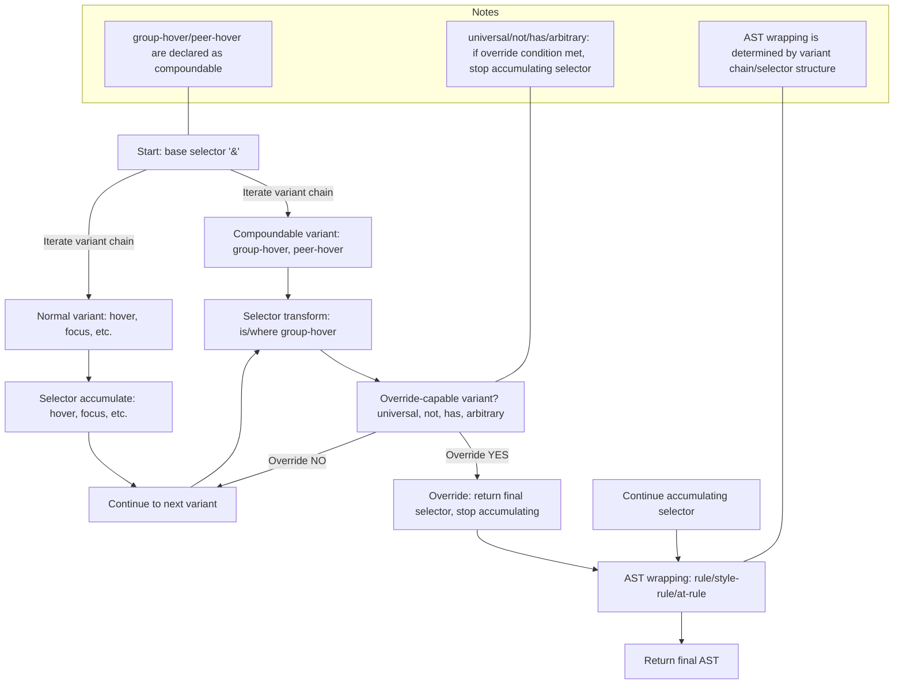

# v4 Variant Selector Accumulation/Override/Compound Rules (Analysis/Summary)



## 1. Core Structure of the Variant System
- **Variant Chain**: Multiple variants applied in order, e.g., `group-hover:not-hover:has-[.child]:*:`.
- **Each variant defines only its own role**: selector transform (accumulate/override), AST wrapping, at-rule wrapping, etc.
- **Cover combinations via accumulation/override rules rather than per-combination functions**

## 2. Official Rules for Selector Accumulation/Override
### (1) Basic accumulation
- The variant chain transforms (accumulates) selectors left → right
  - e.g., `hover:focus:bg-red-500` → `&:hover:focus`
### (2) Override (stop accumulation)
- **Certain variants (e.g., universal, not, has, arbitrary)** return an **override (final selector)** when preceded by group-hover/peer-hover, then accumulation stops
- Once override occurs, subsequent selector transforms are ignored
### (3) Compound rules
- **compoundable**: declare whether a variant can compound with others
- **compoundsWith**: declare when override is required in specific compounds
- **Actual behavior**: if universal comes after group-hover, universal returns the override selector (`&:is(:where(.group):hover > *)`) and stops accumulation

## 3. AST Wrapping Rules
- **Single pseudo/universal/not/has/arbitrary**: wrap as rule
- **Compound combinations (2+ including group/peer/has/not)**: wrap as style-rule
- **At-rules (media queries, etc.)**: wrap AST with at-rule; keep selector unchanged

## 4. Actual v4 Code Structure (based on variants.ts)
- **addVariant(name, generator, options)**: name, generator (accumulation/override/compound handling), options ({ compoundable, compoundsWith, ... })
- **matchVariant**: used for dynamic variant registration
- **compoundable/compoundsWith**: declare whether a variant compounds and which compounds require override
- **overrideSelector**: if generator returns `{ selector, override: true }`, stop accumulation

### (A) Key Function Signatures/Types Example (variants.ts)
```ts
addVariant(
  name: string,
  generator: (selector: string, context: { ... }) => string | { selector: string, override?: boolean },
  options?: { compoundable?: boolean, compoundsWith?: string[], ... }
)
```
- **generator**: selector transformation function. When returning `{ selector, override: true }`, stops subsequent accumulation
- **compoundable/compoundsWith**: declares combination possibility/override necessity

### (B) Custom variant registration example
```ts
addVariant('children', '& > *');
// children:pl-4 → .children\:pl-4 > * { ... }
addVariant('my-variant', (selector) => `:is(.my-parent ${selector})`);
```

### (C) Tips for selector escaping
- Always escape className, arbitrary values, and special characters in selectors
- v4 internally uses utilities like escapeClassName and escapeSelector
- Example: `.\[\&\>\*\]\:underline > * { ... }` (arbitrary variant)

## 5. Simulation Examples (same as v4)
| Variant Chain                      | Selector result (v4)               | Accumulation/override |
|------------------------------------|---------------------------------------------|--------------------|
| `group-hover:*:bg-red-500`         | `&:is(:where(.group):hover > *)`            | universal overrides |
| `group-hover:not-hover:bg-red-500` | `&:is(:where(.group):hover *):not(:hover)`  | not overrides       |
| `peer-hover:has-[.child]:bg-red-500`| `&:is(:where(.peer):hover ~ *):has(.child)` | has overrides       |
| `sm:group-hover:*:bg-red-500`      | `@media (min-width: 640px) { &:is(:where(.group):hover > *) { ... } }` | universal overrides |
| `not-hover:focus:bg-red-500`       | `&:not(:hover):focus`                       | accumulate          |

## 6. Implementation Considerations
### (A) Selector accumulation/override logic
```ts
function processVariantChain(variants: string[], baseSelector: string): string {
  let result = baseSelector;
  
  for (const variant of variants) {
    const variantResult = processVariant(variant, result);
    
    if (variantResult.override) {
      // Stop accumulation when override occurs
      return variantResult.selector;
    }
    
    // Accumulate selector
    result = variantResult.selector;
  }
  
  return result;
}
```

### (B) Handling compoundable/compoundsWith
```ts
function isCompoundable(variant: string): boolean {
  return variant === 'group-hover' || variant === 'peer-hover';
}

function needsOverride(currentVariant: string, previousVariant: string): boolean {
  if (currentVariant === 'universal' && isCompoundable(previousVariant)) {
    return true;
  }
  // Other override conditions...
  return false;
}
```

## 7. Key v4 code related to selector override/compound (variants.ts)
- **addVariant**: declare compoundability with options
- **processVariant**: handle each variant's selector transform
- **overrideSelector**: return final selector when override conditions are met
- **compoundSelector**: combine selectors for compoundable variants

### (A) Core logic flow
1. **Parse variant chain**: `group-hover:not-hover:has-[.child]:*:`
2. **Process sequentially**: handle each variant in order
3. **Check override**: stop accumulation when conditions are met
4. **Accumulate selector**: if not overridden, keep accumulating
5. **AST wrapping**: wrap final selector into AST structure

### (B) Selector escaping
- **className escape**: `.group-hover\:bg-red-500` → `.group-hover\:bg-red-500`
- **arbitrary value escape**: `[&>*]` → `\[\&\>\*\]`
- **special characters in selectors**: `:is(.parent > *)` → `:is\(\.parent\s\>\s\*\)`

### (C) Performance optimizations
- **variant cache**: cache results for identical variant chains
- **selector optimization**: remove unnecessary nesting, merge identical selectors
- **AST optimization**: merge duplicate at-rules and rules

## 8. Practical usage examples and tests
### (A) Basic variant chain
```ts
// hover:focus:bg-red-500
const variants = ['hover', 'focus'];
const result = processVariantChain(variants, '&');
// result: '&:hover:focus'
```

### (B) Compoundable variant
```ts
// group-hover:*:bg-red-500
const variants = ['group-hover', '*'];
const result = processVariantChain(variants, '&');
// result: '&:is(:where(.group):hover > *)'
```

### (C) Override variant
```ts
// group-hover:not-hover:bg-red-500
const variants = ['group-hover', 'not-hover'];
const result = processVariantChain(variants, '&');
// result: '&:is(:where(.group):hover *):not(:hover)'
```

### (D) Compound at-rule
```ts
// sm:group-hover:*:bg-red-500
const variants = ['sm', 'group-hover', '*'];
const result = processVariantChain(variants, '&');
// result: '@media (min-width: 640px) { &:is(:where(.group):hover > *) }'
```

## 9. Error handling and edge cases
### (A) Invalid variant chain
```ts
// *:group-hover (universal must not come before group-hover)
// Error: "Universal variant must come after compoundable variant"
```

### (B) Prevent circular references
```ts
// group-hover:group-hover (duplicate variant)
// Warning: "Duplicate variant detected: group-hover"
```

### (C) Selector validation
```ts
// group-hover:[invalid-selector]
// Error: "Invalid selector syntax: [invalid-selector]"
```

## 10. Extensibility and customization
### (A) Custom variant registration
```ts
addVariant('my-custom', (selector) => `:is(.my-parent ${selector})`);
addVariant('my-compound', (selector) => `:is(.my-wrapper ${selector})`, {
  compoundable: true,
  compoundsWith: ['group-hover']
});
```

### (B) Variant plugin system
```ts
const myVariantPlugin = {
  name: 'my-variants',
  variants: {
    'my-variant': (selector) => `:is(.my-parent ${selector})`,
    'my-compound': (selector) => `:is(.my-wrapper ${selector})`
  }
};
```

### (C) Dynamic variant generation
```ts
function createResponsiveVariant(breakpoint: string) {
  return (selector: string) => `@media (min-width: ${breakpoint}) { ${selector} }`;
}

addVariant('sm', createResponsiveVariant('640px'));
addVariant('md', createResponsiveVariant('768px'));
```

## 11. Advanced: real-world extension/testing/security/compatibility
### (A) Extensibility considerations
- **Variant order**: affects CSS specificity and actual result
- **Selector complexity**: consider performance and readability
- **Browser compatibility**: ensure support for modern selectors like :is(), :where(), :has()

### (B) Config-driven variant system
```ts
// barocss.config.js
module.exports = {
  variants: {
    extend: {
      'my-variant': ['hover', 'focus'],
      'my-compound': ['group-hover', 'peer-hover']
    }
  }
};
```

### (C) Security and validation
- **Selector validation**: validate selectors generated from user input
- **Prevent CSS injection**: protect against malicious selector input
- **v4 includes internal defenses like selector validation, escaping, and allowed-range limits**

### (D) Testing strategy
- **Unit tests**: test each variant's behavior
- **Integration tests**: test combinations of variant chains
- **As AST complexity grows (especially at-rule+style-rule+arbitrary nesting), verify final CSS output matches v4 exactly**

### (E) Plugin system
```ts
// barocsscss/plugin
const plugin = require('barocsscss/plugin');

module.exports = plugin(({ addVariant }) => {
  addVariant('my-variant', (selector) => `:is(.my-parent ${selector})`);
});
```

### (F) Performance optimization
- **Variant cache**: cache results of identical variant chains
- **Selector optimization**: remove unnecessary nesting, merge identical selectors
- **AST optimization**: merge duplicate at-rules and rules

### (G) Browser compatibility
- **CSS selectors**: :is(), :where(), :has(), etc.
- **CSS properties**: verify support for modern properties
- **v3 → v4 migration**: track breaking/compatibility issues in variant system

## 12. True wrapping/flatten/override model in v4 and limitations of order-based loops
### (A) Limitations of order-based loops
- **Order-based processing** is simple but limited
- **Complex combinations** (group-hover + universal + not + has) cannot be fully handled by simple order
- **Dependencies** between variants cannot be reasoned about by order alone

### (B) Real v4 approach: delegate wrapping/flatten/override policies
- **v4 plugins declare**
  - `wrapping`: how to wrap AST
  - `flatten`: how to flatten selectors
  - `override`: when to stop selector accumulation
- **Engine applies these policies as-is**

### (C) Benefits of a policy-based system
- **Extensibility**: add new variants by declaring policies without core changes
- **Accuracy**: each variant precisely defines its behavior
- **Customization**: users can customize variant behavior freely

### (D) Improvement direction for barocss
- **Order+loop alone cannot fully implement v4's semantics**
- **Have variant plugins declare wrapping/flatten/override policies and let the engine apply them**
- **Adopting this structure aligns barocss with v4 in extensibility/accuracy/custom ecosystem**

## Conclusion
- **The variant system is a policy-based complex system, not just order-based**
- **Each variant defines behavior precisely; the engine applies those policies**
- **This enables infinite combinations and extensibility with consistent behavior**
- **barocss should evolve in this direction to achieve parity with v4**