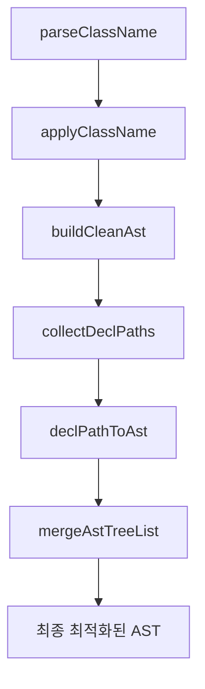

# CSSMA Engine 함수 역할 및 결과물 정의

## 전체 파이프라인 개요



---

## 1. parseClassName()

### 역할
- **입력**: className 문자열 (예: `'group-hover:**:rounded-full'`)
- **처리**: className을 파싱하여 modifiers와 utility로 분리
- **출력**: 파싱된 데이터 구조

### 결과물 예시
```typescript
// 입력: 'group-hover:**:rounded-full'
{
  modifiers: [
    { type: 'group-hover', negative: false },
    { type: '**', negative: false }
  ],
  utility: {
    prefix: 'rounded-full',
    value: '',
    arbitrary: false,
    customProperty: false,
    negative: false,
    opacity: ''
  }
}
```

---

## 2. applyClassName()

### 역할
- **입력**: className 문자열 + CssmaContext
- **처리**: 
  1. utility를 AST로 변환
  2. variant chain을 적용 (각 variant의 wrap/modifySelector 결과를 wrappers에 쌓음)
  3. 모든 variant wrapping path의 데카르트 곱을 계산하여, 각 path별로 baseAst를 바깥→안쪽 순서로 중첩
  4. 여러 root ast를 반환할 수 있음 (sibling 지원)
- **출력**: 개별 className의 AST(variant wrapping 구조 반영)

### 내부 처리 흐름
- modifiers를 순서대로 순회하며, 각 variant의 wrap/modifySelector 결과를 wrappers에 쌓음
- wrap이 여러 wrapping path를 반환하면, 데카르트 곱으로 모든 조합을 생성
- wrappers를 오른쪽→왼쪽(가장 안쪽→가장 바깥) 순서로 baseAst에 적용
- 최종적으로 여러 root ast(AstNode[])를 반환 (sibling 구조 가능)

### 결과물 예시
```typescript
// 입력: 'sm:dark:hover:bg-red-500'
[
  {
    type: 'at-rule',
    name: 'media',
    params: '(min-width: 40rem)',
    nodes: [
      {
        type: 'at-rule',
        name: 'media',
        params: '(prefers-color-scheme: dark)',
        nodes: [
          {
            type: 'rule',
            selector: '&:hover',
            nodes: [
              { type: 'decl', prop: 'background-color', value: 'oklch(63.7% 0.237 25.331)' }
            ]
          }
        ]
      }
    ]
  }
]
```

### 주의사항
- **selector 조합/최적화는 하지 않음** (buildCleanAst에서 처리)
- **여러 root ast(sibling) 반환 가능**
- **variant wrapping 구조(중첩, sibling, 데카르트 곱) 완벽 지원**

---

## 3. buildCleanAst()

### 역할
- **입력**: applyClassName의 결과 AST 배열
- **처리**: 전체 파이프라인 조율 및 최적화
- **출력**: 최종 최적화된 AST

### 내부 처리 흐름
1. `collectDeclPaths()` - AST를 decl-to-root path 리스트로 평탄화
2. `declPathToAst()` - 각 path를 variant 정렬/병합/중첩하여 최적화
3. `mergeAstTreeList()` - 공통 variant prefix 그룹화, 중복 제거, sibling/병합 처리

### 결과물 예시
```typescript
// 입력: applyClassName 결과 (여러 root 가능)
[
  { type: 'at-rule', name: 'media', ... },
  { type: 'at-rule', name: 'media', ... }
]
// 출력: 병합/최적화된 단일 AST
[
  { type: 'at-rule', name: 'media', ... }
]
```

### 주의사항
- **AST 트리의 sibling, 중첩, 병합 등 모든 구조를 최적화**
- **variant wrapping 구조를 완벽하게 반영**

---

## 4. collectDeclPaths()

### 역할
- **입력**: AST 배열
- **처리**: AST를 decl-to-root path 리스트로 평탄화 (variant chain 추출)
- **출력**: DeclPath 배열 (각 decl까지의 variant chain)

### 결과물 예시
```typescript
// 입력: applyClassName 결과
[
  {
    type: 'rule',
    selector: '&',
    nodes: [
      {
        type: 'style-rule',
        selector: ':is(...)',
        nodes: [{ type: 'decl', prop: 'border-radius', value: '9999px' }]
      }
    ]
  }
]
// 출력: DeclPath 배열
[
  [
    { type: 'rule', selector: '&' },
    { type: 'style-rule', selector: ':is(...)' },
    { type: 'decl', prop: 'border-radius', value: '9999px' }
  ]
]
```

### 주의사항
- **wrap/variant용 노드가 있으면 decl까지의 모든 계층을 path로 추출**
- **sibling 구조도 모두 path로 분리**

---

## 5. declPathToAst()

### 역할
- **입력**: 단일 DeclPath (decl-to-root path)
- **처리**: 
  1. variant 정렬 (at-rule > style-rule > rule > decl)
  2. 연속된 동일 variant 병합 (hoist)
  3. 바깥→안쪽 순서로 중첩 AST 생성
- **출력**: 최적화된 중첩 AST

### 결과물 예시
```typescript
// 입력: DeclPath
[
  { type: 'rule', selector: '&' },
  { type: 'style-rule', selector: ':is(...)' },
  { type: 'decl', prop: 'border-radius', value: '9999px' }
]
// 출력: 최적화된 AST
[
  {
    type: 'style-rule',
    selector: ':is(...)',
    nodes: [
      {
        type: 'rule',
        selector: '&',
        nodes: [
          { type: 'decl', prop: 'border-radius', value: '9999px' }
        ]
      }
    ]
  }
]
```

### 주의사항
- **variant 계층이 꼬이지 않도록 정렬/병합**
- **중첩 순서(바깥→안쪽) 보장**

---

## 6. mergeAstTreeList()

### 역할
- **입력**: declPathToAst 결과 배열 (AstNode[][])
- **처리**: 
  1. 공통 variant prefix 그룹화
  2. 중복 제거 및 병합
  3. sibling 구조/최적화
- **출력**: 단일 최적화된 AST

### 결과물 예시
```typescript
// 입력: 여러 개의 최적화된 AST
[
  [{ type: 'style-rule', selector: ':is(...)', nodes: [...] }],
  [{ type: 'style-rule', selector: ':is(...)', nodes: [...] }]
]
// 출력: 병합된 단일 AST
[
  {
    type: 'style-rule',
    selector: ':is(.group-hover\:\*\*\:rounded-full *)',
    nodes: [
      { type: 'decl', prop: 'border-radius', value: '9999px' }
    ]
  }
]
```

### 주의사항
- **공통 variant prefix(예: 같은 at-rule, rule 등)는 하나로 합치고, 그 아래는 sibling으로 분리**
- **최적화된 AST 트리로 재구성**

---

## 7. generateUtilityCss()

### 역할
- **입력**: classList(string), CssmaContext, 옵션
- **처리**: 
  1. classList를 공백 기준으로 분리
  2. 각 className마다 applyClassName → buildCleanAst → astToCss 순으로 처리
  3. dedup, minify 등 옵션 적용
- **출력**: string (여러 CSS 블록이 join된 결과)

### 결과물 예시
```typescript
// 입력: 'sm:dark:hover:bg-red-500 sm:focus:bg-blue-500'
/* ...최적화된 CSS ... */
```

### 주의사항
- **각 className별로 AST 생성/최적화/변환을 독립적으로 수행**
- **dedup, minify 등 옵션 지원**

---

## 전체 플로우 예시 (복잡한 variant chain)

### 입력: `'sm:dark:hover:bg-red-500 sm:focus:bg-blue-500'`

1. **parseClassName**: `{ modifiers: [...], utility: {...} }`
2. **applyClassName**: `[{ type: 'at-rule', ... }, ...]` (여러 root 가능)
3. **buildCleanAst**: `[...최적화된 AST 트리...]`
4. **astToCss**: `최종 CSS 문자열`

### 최종 결과 예시
```typescript
/*
@media (min-width: 40rem) {
  @media (prefers-color-scheme: dark) {
    &:hover { background-color: oklch(63.7% 0.237 25.331) }
  }
  &:focus { background-color: oklch(62.3% 0.214 259.815) }
}
*/
```

---

## 역할 분담 원칙 (단일 책임)

- **parseClassName**: 파싱만
- **applyClassName**: AST 생성(variant wrapping 구조 반영)
- **buildCleanAst**: AST 최적화/병합/정리
- **collectDeclPaths**: AST 평탄화(variant chain 추출)
- **declPathToAst**: 개별 path 최적화(variant 정렬/병합/중첩)
- **mergeAstTreeList**: 최종 트리 재구성/병합/최적화
- **generateUtilityCss**: 전체 파이프라인 orchestration 및 CSS 변환

---

## AST 트리 구조와 variant wrapping의 실제 예시

### 1. 단일 variant chain
```typescript
// 입력: 'sm:hover:bg-red-500'
applyClassName 결과:
[
  {
    type: 'at-rule',
    name: 'media',
    params: '(min-width: 40rem)',
    nodes: [
      {
        type: 'rule',
        selector: '&:hover',
        nodes: [
          { type: 'decl', prop: 'background-color', value: 'oklch(63.7% 0.237 25.331)' }
        ]
      }
    ]
  }
]
```

### 2. 다중 variant chain (sibling)
```typescript
// 입력: 'sm:hover:bg-red-500 sm:focus:bg-blue-500'
applyClassName 결과:
[
  { ...sm:hover... },
  { ...sm:focus... }
]
buildCleanAst 결과:
[
  {
    type: 'at-rule',
    name: 'media',
    params: '(min-width: 40rem)',
    nodes: [
      { ...hover... },
      { ...focus... }
    ]
  }
]
```

### 3. dark + responsive + interaction 중첩
```typescript
// 입력: 'sm:dark:hover:bg-red-500'
applyClassName 결과:
[
  {
    type: 'at-rule',
    name: 'media',
    params: '(min-width: 40rem)',
    nodes: [
      {
        type: 'at-rule',
        name: 'media',
        params: '(prefers-color-scheme: dark)',
        nodes: [
          {
            type: 'rule',
            selector: '&:hover',
            nodes: [
              { type: 'decl', prop: 'background-color', value: 'oklch(63.7% 0.237 25.331)' }
            ]
          }
        ]
      }
    ]
  }
]
```

### 4. dark + responsive + sibling
```typescript
// 입력: 'dark:bg-green-500 sm:dark:bg-yellow-500'
applyClassName 결과:
[
  {
    type: 'at-rule',
    name: 'media',
    params: '(prefers-color-scheme: dark)',
    nodes: [
      { type: 'decl', prop: 'background-color', value: 'green' }
    ]
  },
  {
    type: 'at-rule',
    name: 'media',
    params: '(min-width: 40rem)',
    nodes: [
      {
        type: 'at-rule',
        name: 'media',
        params: '(prefers-color-scheme: dark)',
        nodes: [
          { type: 'decl', prop: 'background-color', value: 'yellow' }
        ]
      }
    ]
  }
]
buildCleanAst 결과:
[
  {
    type: 'at-rule',
    name: 'media',
    params: '(prefers-color-scheme: dark)',
    nodes: [
      { type: 'decl', prop: 'background-color', value: 'green' }
    ]
  },
  {
    type: 'at-rule',
    name: 'media',
    params: '(min-width: 40rem)',
    nodes: [
      {
        type: 'at-rule',
        name: 'media',
        params: '(prefers-color-scheme: dark)',
        nodes: [
          { type: 'decl', prop: 'background-color', value: 'yellow' }
        ]
      }
    ]
  }
]
```

---

## 예외/주의사항 및 베스트 프랙티스

- 각 함수는 단일 책임 원칙을 지켜야 하며, 파이프라인의 역할 분담을 명확히 해야 함
- variant wrapping 구조(중첩, sibling, 데카르트 곱 등)는 반드시 applyClassName에서 완성되어야 함
- buildCleanAst는 AST 트리의 sibling/중첩/병합/최적화만 담당
- AST 구조가 바뀌면 테스트/스냅샷을 반드시 갱신
- dedup, minify 등 옵션은 generateUtilityCss에서만 처리
- AST 트리의 undefined/누락 필드 등은 toEqual로 비교할 때만 신경

---

## 결론

- cssma-v4 엔진은 Tailwind v4와 동일한 variant wrapping 구조(데카르트 곱, sibling, 중첩, 병합 등)를 완벽하게 지원
- 각 함수의 역할, 입력/출력, 내부 처리 흐름, AST 트리 구조, 예외/주의사항을 명확히 이해하고 작성해야 함
- 문서/테스트/코드가 항상 일치하도록 관리할 것 