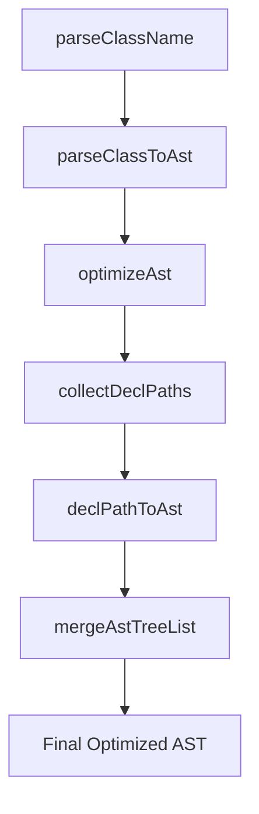

# CSSMA Engine Function Roles and Outputs

## Full Pipeline Overview



---

## 1. parseClassName()

### Role

- **Input**: className string (e.g., `'group-hover:**:rounded-full'`)
- **Process**: parse className into modifiers and utility
- **Output**: parsed data structure

### Example Output

```typescript
// Input: 'group-hover:**:rounded-full'
{
  modifiers: [
    { type: 'group-hover', negative: false },
    { type: '**', negative: false }
  ],
  utility: {
    prefix: 'rounded-full',
    value: '',
    arbitrary: false,
    customProperty: false,
    negative: false,
    opacity: ''
  }
}
```

---

## 2. parseClassToAst()

### Role

- **Input**: className string + CssmaContext
- **Process**:
  1. Convert utility to AST
  2. Apply variant chain (accumulate wrap/modifySelector results into wrappers)
  3. Compute Cartesian product of wrapping paths; nest baseAst outer→inner per path
  4. Can return multiple root ASTs (supports siblings)
- **Output**: AST for each className (variant wrapping reflected)

### Internal Flow

- Traverse modifiers in order; push each variant's wrap/modifySelector to wrappers
- If wrap returns multiple paths, generate all via Cartesian product
- Apply wrappers right→left (inner→outer) to baseAst
- Return multiple root ASTs (siblings possible)

### Example Output

```typescript
// Input: 'sm:dark:hover:bg-red-500'
[
  {
    type: "at-rule",
    name: "media",
    params: "(min-width: 40rem)",
    nodes: [
      {
        type: "at-rule",
        name: "media",
        params: "(prefers-color-scheme: dark)",
        nodes: [
          {
            type: "rule",
            selector: "&:hover",
            nodes: [
              {
                type: "decl",
                prop: "background-color",
                value: "oklch(63.7% 0.237 25.331)",
              },
            ],
          },
        ],
      },
    ],
  },
];
```

### Notes

- **No selector combination/optimization here** (handled in optimizeAst)
- **May return multiple root ASTs (siblings)**
- **Fully supports variant wrapping (nesting/sibling/Cartesian)**

---

## 3. optimizeAst()

### Role

- **Input**: AST array from parseClassToAst
- **Process**: pipeline orchestration and optimization
- **Output**: final optimized AST

### Internal Flow

1. `collectDeclPaths()` - flatten AST to decl-to-root paths
2. `declPathToAst()` - optimize each path by sorting/merging/nesting variants
3. `mergeAstTreeList()` - group common prefixes, dedupe, merge siblings

### Example Output

```typescript
// Input: parseClassToAst result (multiple roots possible)
[
  { type: 'at-rule', name: 'media', ... },
  { type: 'at-rule', name: 'media', ... }
]
// Output: single merged/optimized AST
[
  { type: 'at-rule', name: 'media', ... }
]
```

### Notes

- **Optimize siblings/nesting/merging in AST**
- **Fully reflect variant wrapping structure**

---

## 4. collectDeclPaths()

### Role

- **Input**: AST array
- **Process**: flatten AST to decl-to-root paths (extract variant chains)
- **Output**: DeclPath array (variant chain to each decl)

### Example Output

```typescript
// Input: parseClassToAst result
[
  {
    type: "rule",
    selector: "&",
    nodes: [
      {
        type: "style-rule",
        selector: ":is(...)",
        nodes: [{ type: "decl", prop: "border-radius", value: "9999px" }],
      },
    ],
  },
][
  // Output: DeclPath array
  [
    { type: "rule", selector: "&" },
    { type: "style-rule", selector: ":is(...)" },
    { type: "decl", prop: "border-radius", value: "9999px" },
  ]
];
```

### Notes

- **If wrap/variant nodes exist, extract all levels to decl as paths**
- **Split sibling structures into paths as well**

---

## 5. declPathToAst()

### Role

- **Input**: single DeclPath (decl-to-root path)
- **Process**:
  1. Sort variants (at-rule > style-rule > rule > decl)
  2. Merge consecutive identical variants (hoist)
  3. Extract rule variants and group by source (variant role)
  4. Sort groups by sourcePriority
  5. Compose selectors within group (pseudo: reduce, others: reduceRight)
  6. Compose group selectors outer→inner
  7. Nest remaining variants (e.g., at-rule) outside
- **Output**: optimized nested AST

### 상세 알고리즘 및 내부 처리

#### 1. Sort and merge (hoist) variants

- Sort by type priority (at-rule, style-rule, rule, decl)
- Merge consecutive identical variants (same key)

#### 2. Extract rule variants and group by source

- Extract only variants of type "rule"
- Assign source (variant role: group, pseudo, attribute, etc.)
- Group by source

#### 3. Sort by sourcePriority

- Order groups outer→inner based on sourcePriority  
  (e.g., media > responsive > group > attribute > pseudo > base)

#### 4. Compose selectors within groups

- **pseudo**: inside→outside (reduce)  
  (e.g., &:focus, &:hover → &:focus:hover)
- **others**: outside→inside (reduceRight)  
  (e.g., .group:hover &, .peer:focus ~ & → .group:hover .peer:focus ~ &)
- Compose a single selector per group

#### 5. Final composition per group

- Reduce composed selectors outer→inner  
  (e.g., group > attribute > pseudo → .group:hover &[aria-pressed]:hover)

#### 6. Nest remaining variants outside (e.g., at-rule)

- Nest non-rule variants from outside in

### 주요 상수/함수

#### sourcePriority

```typescript
const sourcePriority = {
  media: 0,
  supports: 1,
  container: 2,
  responsive: 10,
  group: 20,
  peer: 30,
  dark: 40,
  universal: 50,
  data: 60,
  aria: 70,
  attribute: 80,
  pseudo: 90,
  base: 100,
  starting: 110,
};
```

#### getRulePriority

- rule.source를 기반으로 sourcePriority에서 우선순위 반환

#### mergeSelectorsBySource

- source가 pseudo면 reduce(안→바깥), 아니면 reduceRight(바깥→안)
- &가 있으면 한 번만 치환, 없으면 공백으로 연결

### Example Output

```typescript
// Input: DeclPath
[
  { type: "rule", selector: ".group:hover &", source: "group" },
  { type: "rule", selector: '&[aria-pressed="true"]', source: "attribute" },
  { type: "rule", selector: "&:hover", source: "pseudo" },
  { type: "decl", prop: "color", value: "green" },
][
  // Output: optimized AST
  {
    type: "rule",
    selector: '.group:hover &[aria-pressed="true"]:hover',
    nodes: [{ type: "decl", prop: "color", value: "green" }],
  }
];
```

### Notes

- Treat missing source as base
- Follow sourcePriority and group composition rules to avoid order issues
- If '&' appears multiple times, replace only the outermost

---

## 6. mergeAstTreeList()

### Role

- **Input**: array of declPathToAst results (AstNode[][])
- **Process**:
  1. Group common variant prefixes
  2. Remove duplicates and merge
  3. Optimize sibling structure
- **Output**: single optimized AST

### Example Output

```typescript
// Input: multiple optimized ASTs
[
  [{ type: 'style-rule', selector: ':is(...)', nodes: [...] }],
  [{ type: 'style-rule', selector: ':is(...)', nodes: [...] }]
]
// Output: merged single AST
[
  {
    type: 'style-rule',
    selector: ':is(.group-hover\:\*\*\:rounded-full *)',
    nodes: [
      { type: 'decl', prop: 'border-radius', value: '9999px' }
    ]
  }
]
```

### Notes

- **Merge common variant prefixes (e.g., same at-rule/rule) and split siblings below**
- **Reconstruct into optimized AST**

---

## 7. generateCss()

### Role

- **Input**: classList(string), CssmaContext, options
- **Process**:
  1. Split classList by whitespace
  2. For each className, run parseClassToAst → optimizeAst → astToCss
  3. Apply options (dedup, minify)
- **Output**: string (joined CSS blocks)

### Example Output

```typescript
// Input: 'sm:dark:hover:bg-red-500 sm:focus:bg-blue-500'
/* ...optimized CSS ... */
```

### Notes

- **Build/optimize/convert AST independently per className**
- **Support options like dedup, minify**

---

## Full Flow Example (complex variant chain)

### Input: `'sm:dark:hover:bg-red-500 sm:focus:bg-blue-500'`

1. **parseClassName**: `{ modifiers: [...], utility: {...} }`
2. **parseClassToAst**: `[{ type: 'at-rule', ... }, ...]` (여러 root 가능)
3. **optimizeAst**: `[...optimized AST tree...]`
4. **astToCss**: `final CSS string`

### Final Result Example

```typescript
/*
@media (min-width: 40rem) {
  @media (prefers-color-scheme: dark) {
    &:hover { background-color: oklch(63.7% 0.237 25.331) }
  }
  &:focus { background-color: oklch(62.3% 0.214 259.815) }
}
*/
```

---

## Role Separation Principles (Single Responsibility)

- **parseClassName**: parsing only
- **parseClassToAst**: build AST (reflect variant wrapping)
- **optimizeAst**: optimize/merge/clean AST
- **collectDeclPaths**: flatten AST (extract variant chains)
- **declPathToAst**: optimize path (sort/merge/nest variants)
- **mergeAstTreeList**: reconstruct/merge/optimize final tree
- **generateCss**: orchestrate pipeline and generate CSS

---

## Real Examples of AST Tree Structure and Variant Wrapping

### 1. Single variant chain

```typescript
// Input: 'sm:hover:bg-red-500'
parseClassToAst result:
[
  {
    type: 'at-rule',
    name: 'media',
    params: '(min-width: 40rem)',
    nodes: [
      {
        type: 'rule',
        selector: '&:hover',
        nodes: [
          { type: 'decl', prop: 'background-color', value: 'oklch(63.7% 0.237 25.331)' }
        ]
      }
    ]
  }
]
```

### 2. Multiple variant chains (sibling)

```typescript
// Input: 'sm:hover:bg-red-500 sm:focus:bg-blue-500'
parseClassToAst result:
[
  { ...sm:hover... },
  { ...sm:focus... }
]
optimizeAst result:
[
  {
    type: 'at-rule',
    name: 'media',
    params: '(min-width: 40rem)',
    nodes: [
      { ...hover... },
      { ...focus... }
    ]
  }
]
```

### 3. dark + responsive + interaction nesting

```typescript
// Input: 'sm:dark:hover:bg-red-500'
parseClassToAst result:
[
  {
    type: 'at-rule',
    name: 'media',
    params: '(min-width: 40rem)',
    nodes: [
      {
        type: 'at-rule',
        name: 'media',
        params: '(prefers-color-scheme: dark)',
        nodes: [
          {
            type: 'rule',
            selector: '&:hover',
            nodes: [
              { type: 'decl', prop: 'background-color', value: 'oklch(63.7% 0.237 25.331)' }
            ]
          }
        ]
      }
    ]
  }
]
```

### 4. dark + responsive + sibling

```typescript
// Input: 'dark:bg-green-500 sm:dark:bg-yellow-500'
parseClassToAst result:
[
  {
    type: 'at-rule',
    name: 'media',
    params: '(prefers-color-scheme: dark)',
    nodes: [
      { type: 'decl', prop: 'background-color', value: 'green' }
    ]
  },
  {
    type: 'at-rule',
    name: 'media',
    params: '(min-width: 40rem)',
    nodes: [
      {
        type: 'at-rule',
        name: 'media',
        params: '(prefers-color-scheme: dark)',
        nodes: [
          { type: 'decl', prop: 'background-color', value: 'yellow' }
        ]
      }
    ]
  }
]
optimizeAst result:
[
  {
    type: 'at-rule',
    name: 'media',
    params: '(prefers-color-scheme: dark)',
    nodes: [
      { type: 'decl', prop: 'background-color', value: 'green' }
    ]
  },
  {
    type: 'at-rule',
    name: 'media',
    params: '(min-width: 40rem)',
    nodes: [
      {
        type: 'at-rule',
        name: 'media',
        params: '(prefers-color-scheme: dark)',
        nodes: [
          { type: 'decl', prop: 'background-color', value: 'yellow' }
        ]
      }
    ]
  }
]
```

---

## Exceptions/Notes and Best Practices

- Each function should follow single responsibility; clarify pipeline role separation
- Complete variant wrapping (nesting/sibling/Cartesian) in parseClassToAst
- optimizeAst only handles sibling/nesting/merge/optimization
- Update tests/snapshots if AST structure changes
- Only handle options like dedup, minify in generateCss
- For undefined/missing fields, care only when asserting with toEqual

---

## Conclusion

- The cssma-v4 engine fully supports modern CSS variant wrapping (Cartesian product, siblings, nesting, merging)
- Understand and document roles, inputs/outputs, flows, AST structures, and caveats clearly
- Keep documentation, tests, and code consistently aligned
