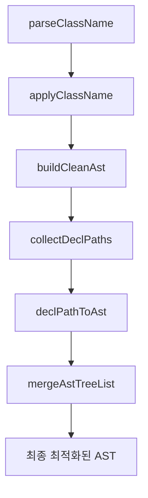

# CSSMA Engine 함수 역할 및 결과물 정의

## 전체 파이프라인 개요



## 1. parseClassName()

### 역할
- **입력**: className 문자열 (예: `'group-hover:**:rounded-full'`)
- **처리**: className을 파싱하여 modifiers와 utility로 분리
- **출력**: 파싱된 데이터 구조

### 결과물 예시
```typescript
// 입력: 'group-hover:**:rounded-full'
{
  modifiers: [
    { type: 'group-hover', negative: false },
    { type: '**', negative: false }
  ],
  utility: {
    prefix: 'rounded-full',
    value: '',
    arbitrary: false,
    customProperty: false,
    negative: false,
    opacity: ''
  }
}
```

---

## 2. applyClassName()

### 역할
- **입력**: className 문자열 + CssmaContext
- **처리**: 
  1. utility를 AST로 변환
  2. variant chain을 적용 (wrapping 정보 포함)
  3. 기본 AST 구조 반환 (selector 조합 없이)
- **출력**: 개별 className의 기본 AST

### 결과물 예시
```typescript
// 입력: 'group-hover:**:rounded-full'
[
  {
    type: 'rule',
    selector: '&',  // 기본 selector (조합 없이)
    nodes: [
      {
        type: 'style-rule',
        selector: ':is(.group-hover\\:\\*\\*\\:rounded-full *)',
        nodes: [
          { type: 'decl', prop: 'border-radius', value: '9999px' }
        ]
      }
    ]
  }
]
```

### 주의사항
- **selector 조합은 하지 않음** (상위에서 처리)
- **최적화는 하지 않음** (buildCleanAst에서 처리)
- **wrapping 정보는 포함** (variant chain 처리)

---

## 3. buildCleanAst()

### 역할
- **입력**: applyClassName의 결과 AST 배열
- **처리**: 전체 파이프라인 조율
- **출력**: 최종 최적화된 AST

### 파이프라인
1. `collectDeclPaths()` - AST 평탄화
2. `declPathToAst()` - 각 path 최적화 (sort, hoist)
3. `mergeAstTreeList()` - 최종 트리 재구성

---

## 4. collectDeclPaths()

### 역할
- **입력**: AST 배열
- **처리**: AST를 decl-to-root path 리스트로 평탄화
- **출력**: DeclPath 배열

### 결과물 예시
```typescript
// 입력: applyClassName 결과
[
  {
    type: 'rule',
    selector: '&',
    nodes: [
      {
        type: 'style-rule',
        selector: ':is(...)',
        nodes: [{ type: 'decl', prop: 'border-radius', value: '9999px' }]
      }
    ]
  }
]

// 출력: DeclPath 배열
[
  [
    { type: 'rule', selector: '&' },
    { type: 'style-rule', selector: ':is(...)' },
    { type: 'decl', prop: 'border-radius', value: '9999px' }
  ]
]
```

---

## 5. declPathToAst()

### 역할
- **입력**: 단일 DeclPath (decl-to-root path)
- **처리**: 
  1. variant 정렬 (at-rule > style-rule > rule > decl)
  2. 연속된 동일 variant 병합 (hoist)
  3. 중첩 AST 생성
- **출력**: 최적화된 중첩 AST

### 결과물 예시
```typescript
// 입력: DeclPath
[
  { type: 'rule', selector: '&' },
  { type: 'style-rule', selector: ':is(...)' },
  { type: 'decl', prop: 'border-radius', value: '9999px' }
]

// 출력: 최적화된 AST
[
  {
    type: 'style-rule',
    selector: ':is(...)',
    nodes: [
      {
        type: 'rule',
        selector: '&',
        nodes: [
          { type: 'decl', prop: 'border-radius', value: '9999px' }
        ]
      }
    ]
  }
]
```

---

## 6. mergeAstTreeList()

### 역할
- **입력**: declPathToAst 결과 배열 (AstNode[][])
- **처리**: 
  1. 공통 variant prefix 그룹화
  2. 중복 제거 및 병합
  3. 최종 트리 재구성
- **출력**: 단일 최적화된 AST

### 결과물 예시
```typescript
// 입력: 여러 개의 최적화된 AST
[
  [{ type: 'style-rule', selector: ':is(...)', nodes: [...] }],
  [{ type: 'style-rule', selector: ':is(...)', nodes: [...] }]
]

// 출력: 병합된 단일 AST
[
  {
    type: 'style-rule',
    selector: ':is(.group-hover\\:\\*\\*\\:rounded-full *)',
    nodes: [
      { type: 'decl', prop: 'border-radius', value: '9999px' }
    ]
  }
]
```

---

## 전체 플로우 예시

### 입력: `'group-hover:**:rounded-full'`

1. **parseClassName**: `{ modifiers: [...], utility: {...} }`
2. **applyClassName**: `[{ type: 'rule', selector: '&', nodes: [...] }]`
3. **collectDeclPaths**: `[[{ type: 'rule' }, { type: 'style-rule' }, { type: 'decl' }]]`
4. **declPathToAst**: `[{ type: 'style-rule', nodes: [...] }]`
5. **mergeAstTreeList**: `[{ type: 'style-rule', selector: '...', nodes: [...] }]`

### 최종 결과
```typescript
[
  {
    type: 'style-rule',
    selector: ':is(.group-hover\\:\\*\\*\\:rounded-full *)',
    nodes: [
      { type: 'decl', prop: 'border-radius', value: '9999px' }
    ]
  }
]
```

---

## 역할 분담 원칙

### 데이터 수집 단계
- **parseClassName**: 파싱만
- **applyClassName**: 기본 AST 생성만

### 최적화 단계
- **collectDeclPaths**: 평탄화만
- **declPathToAst**: 개별 최적화만
- **mergeAstTreeList**: 재구성만

### 각 함수는 단일 책임 원칙을 따름
- 한 가지 역할만 수행
- 다른 함수의 역할을 침범하지 않음
- 명확한 입력/출력 정의 