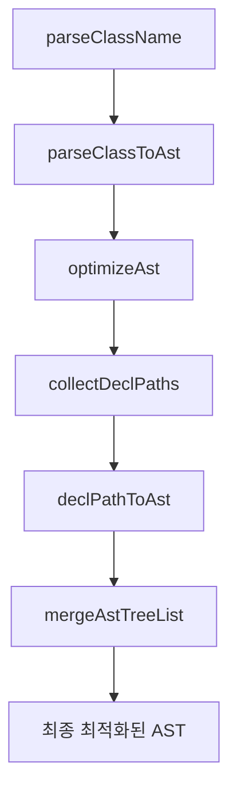

# CSSMA Engine 함수 역할 및 결과물 정의

## 전체 파이프라인 개요



---

## 1. parseClassName()

### 역할

- **입력**: className 문자열 (예: `'group-hover:**:rounded-full'`)
- **처리**: className을 파싱하여 modifiers와 utility로 분리
- **출력**: 파싱된 데이터 구조

### 결과물 예시

```typescript
// 입력: 'group-hover:**:rounded-full'
{
  modifiers: [
    { type: 'group-hover', negative: false },
    { type: '**', negative: false }
  ],
  utility: {
    prefix: 'rounded-full',
    value: '',
    arbitrary: false,
    customProperty: false,
    negative: false,
    opacity: ''
  }
}
```

---

## 2. parseClassToAst()

### 역할

- **입력**: className 문자열 + CssmaContext
- **처리**:
  1. utility를 AST로 변환
  2. variant chain을 적용 (각 variant의 wrap/modifySelector 결과를 wrappers에 쌓음)
  3. 모든 variant wrapping path의 데카르트 곱을 계산하여, 각 path별로 baseAst를 바깥→안쪽 순서로 중첩
  4. 여러 root ast를 반환할 수 있음 (sibling 지원)
- **출력**: 개별 className의 AST(variant wrapping 구조 반영)

### 내부 처리 흐름

- modifiers를 순서대로 순회하며, 각 variant의 wrap/modifySelector 결과를 wrappers에 쌓음
- wrap이 여러 wrapping path를 반환하면, 데카르트 곱으로 모든 조합을 생성
- wrappers를 오른쪽→왼쪽(가장 안쪽→가장 바깥) 순서로 baseAst에 적용
- 최종적으로 여러 root ast(AstNode[])를 반환 (sibling 구조 가능)

### 결과물 예시

```typescript
// 입력: 'sm:dark:hover:bg-red-500'
[
  {
    type: "at-rule",
    name: "media",
    params: "(min-width: 40rem)",
    nodes: [
      {
        type: "at-rule",
        name: "media",
        params: "(prefers-color-scheme: dark)",
        nodes: [
          {
            type: "rule",
            selector: "&:hover",
            nodes: [
              {
                type: "decl",
                prop: "background-color",
                value: "oklch(63.7% 0.237 25.331)",
              },
            ],
          },
        ],
      },
    ],
  },
];
```

### 주의사항

- **selector 조합/최적화는 하지 않음** (optimizeAst에서 처리)
- **여러 root ast(sibling) 반환 가능**
- **variant wrapping 구조(중첩, sibling, 데카르트 곱) 완벽 지원**

---

## 3. optimizeAst()

### 역할

- **입력**: parseClassToAst의 결과 AST 배열
- **처리**: 전체 파이프라인 조율 및 최적화
- **출력**: 최종 최적화된 AST

### 내부 처리 흐름

1. `collectDeclPaths()` - AST를 decl-to-root path 리스트로 평탄화
2. `declPathToAst()` - 각 path를 variant 정렬/병합/중첩하여 최적화
3. `mergeAstTreeList()` - 공통 variant prefix 그룹화, 중복 제거, sibling/병합 처리

### 결과물 예시

```typescript
// 입력: parseClassToAst 결과 (여러 root 가능)
[
  { type: 'at-rule', name: 'media', ... },
  { type: 'at-rule', name: 'media', ... }
]
// 출력: 병합/최적화된 단일 AST
[
  { type: 'at-rule', name: 'media', ... }
]
```

### 주의사항

- **AST 트리의 sibling, 중첩, 병합 등 모든 구조를 최적화**
- **variant wrapping 구조를 완벽하게 반영**

---

## 4. collectDeclPaths()

### 역할

- **입력**: AST 배열
- **처리**: AST를 decl-to-root path 리스트로 평탄화 (variant chain 추출)
- **출력**: DeclPath 배열 (각 decl까지의 variant chain)

### 결과물 예시

```typescript
// 입력: parseClassToAst 결과
[
  {
    type: "rule",
    selector: "&",
    nodes: [
      {
        type: "style-rule",
        selector: ":is(...)",
        nodes: [{ type: "decl", prop: "border-radius", value: "9999px" }],
      },
    ],
  },
][
  // 출력: DeclPath 배열
  [
    { type: "rule", selector: "&" },
    { type: "style-rule", selector: ":is(...)" },
    { type: "decl", prop: "border-radius", value: "9999px" },
  ]
];
```

### 주의사항

- **wrap/variant용 노드가 있으면 decl까지의 모든 계층을 path로 추출**
- **sibling 구조도 모두 path로 분리**

---

## 5. declPathToAst()

### 역할

- **입력**: 단일 DeclPath (decl-to-root path)
- **처리**:
  1. variant 정렬 (at-rule > style-rule > rule > decl)
  2. 연속된 동일 variant 병합 (hoist)
  3. rule 계열만 분리하여 source(variant role)별로 그룹핑
  4. sourcePriority 기준으로 그룹 정렬
  5. 각 그룹 내에서 selector 합성 (pseudo는 reduce, 나머지는 reduceRight)
  6. 그룹별 selector를 바깥→안쪽 순서로 최종 합성
  7. 나머지 variant(예: at-rule)는 바깥에서 중첩
- **출력**: 최적화된 중첩 AST

### 상세 알고리즘 및 내부 처리

#### 1. variant 정렬 및 병합(hoist)

- type(at-rule, style-rule, rule, decl) 우선순위로 정렬
- 연속된 동일 variant(동일 key)는 병합(hoist)

#### 2. rule 계열만 분리 및 source별 그룹핑

- type이 "rule"인 variant만 추출
- 각 rule에 source(variant 역할: group, pseudo, attribute 등) 필드 부여
- source별로 그룹핑

#### 3. sourcePriority 기준 정렬

- sourcePriority 테이블에 따라 그룹을 바깥→안쪽 순서로 정렬  
  (예: media > responsive > group > attribute > pseudo > base)

#### 4. 그룹 내 selector 합성

- **pseudo**: 안쪽→바깥(reduce)  
  (예: &:focus, &:hover → &:focus:hover)
- **나머지**: 바깥→안쪽(reduceRight)  
  (예: .group:hover &, .peer:focus ~ & → .group:hover .peer:focus ~ &)
- 각 그룹 내에서 selector를 합성하여 하나의 selector로 만듦

#### 5. 그룹별 selector 최종 합성

- 그룹별로 합성된 selector를 바깥→안쪽 순서로 reduce  
  (예: group > attribute > pseudo → .group:hover &[aria-pressed]:hover)

#### 6. 나머지 variant(예: at-rule) 바깥에서 중첩

- rule 이외의 variant는 바깥에서부터 차례로 중첩

### 주요 상수/함수

#### sourcePriority

```typescript
const sourcePriority = {
  media: 0,
  supports: 1,
  container: 2,
  responsive: 10,
  group: 20,
  peer: 30,
  dark: 40,
  universal: 50,
  data: 60,
  aria: 70,
  attribute: 80,
  pseudo: 90,
  base: 100,
  starting: 110,
};
```

#### getRulePriority

- rule.source를 기반으로 sourcePriority에서 우선순위 반환

#### mergeSelectorsBySource

- source가 pseudo면 reduce(안→바깥), 아니면 reduceRight(바깥→안)
- &가 있으면 한 번만 치환, 없으면 공백으로 연결

### 결과물 예시

```typescript
// 입력: DeclPath
[
  { type: "rule", selector: ".group:hover &", source: "group" },
  { type: "rule", selector: '&[aria-pressed="true"]', source: "attribute" },
  { type: "rule", selector: "&:hover", source: "pseudo" },
  { type: "decl", prop: "color", value: "green" },
][
  // 출력: 최적화된 AST
  {
    type: "rule",
    selector: '.group:hover &[aria-pressed="true"]:hover',
    nodes: [{ type: "decl", prop: "color", value: "green" }],
  }
];
```

### 주의사항

- source가 없는 경우 base로 처리
- selector 합성 순서가 꼬이지 않도록 sourcePriority와 그룹 내 합성 규칙을 반드시 지킬 것
- &가 여러 번 등장하는 경우, 가장 바깥 &만 치환

---

## 6. mergeAstTreeList()

### 역할

- **입력**: declPathToAst 결과 배열 (AstNode[][])
- **처리**:
  1. 공통 variant prefix 그룹화
  2. 중복 제거 및 병합
  3. sibling 구조/최적화
- **출력**: 단일 최적화된 AST

### 결과물 예시

```typescript
// 입력: 여러 개의 최적화된 AST
[
  [{ type: 'style-rule', selector: ':is(...)', nodes: [...] }],
  [{ type: 'style-rule', selector: ':is(...)', nodes: [...] }]
]
// 출력: 병합된 단일 AST
[
  {
    type: 'style-rule',
    selector: ':is(.group-hover\:\*\*\:rounded-full *)',
    nodes: [
      { type: 'decl', prop: 'border-radius', value: '9999px' }
    ]
  }
]
```

### 주의사항

- **공통 variant prefix(예: 같은 at-rule, rule 등)는 하나로 합치고, 그 아래는 sibling으로 분리**
- **최적화된 AST 트리로 재구성**

---

## 7. generateCss()

### 역할

- **입력**: classList(string), CssmaContext, 옵션
- **처리**:
  1. classList를 공백 기준으로 분리
  2. 각 className마다 parseClassToAst → optimizeAst → astToCss 순으로 처리
  3. dedup, minify 등 옵션 적용
- **출력**: string (여러 CSS 블록이 join된 결과)

### 결과물 예시

```typescript
// 입력: 'sm:dark:hover:bg-red-500 sm:focus:bg-blue-500'
/* ...최적화된 CSS ... */
```

### 주의사항

- **각 className별로 AST 생성/최적화/변환을 독립적으로 수행**
- **dedup, minify 등 옵션 지원**

---

## 전체 플로우 예시 (복잡한 variant chain)

### 입력: `'sm:dark:hover:bg-red-500 sm:focus:bg-blue-500'`

1. **parseClassName**: `{ modifiers: [...], utility: {...} }`
2. **parseClassToAst**: `[{ type: 'at-rule', ... }, ...]` (여러 root 가능)
3. **optimizeAst**: `[...최적화된 AST 트리...]`
4. **astToCss**: `최종 CSS 문자열`

### 최종 결과 예시

```typescript
/*
@media (min-width: 40rem) {
  @media (prefers-color-scheme: dark) {
    &:hover { background-color: oklch(63.7% 0.237 25.331) }
  }
  &:focus { background-color: oklch(62.3% 0.214 259.815) }
}
*/
```

---

## 역할 분담 원칙 (단일 책임)

- **parseClassName**: 파싱만
- **parseClassToAst**: AST 생성(variant wrapping 구조 반영)
- **optimizeAst**: AST 최적화/병합/정리
- **collectDeclPaths**: AST 평탄화(variant chain 추출)
- **declPathToAst**: 개별 path 최적화(variant 정렬/병합/중첩)
- **mergeAstTreeList**: 최종 트리 재구성/병합/최적화
- **generateCss**: 전체 파이프라인 orchestration 및 CSS 변환

---

## AST 트리 구조와 variant wrapping의 실제 예시

### 1. 단일 variant chain

```typescript
// 입력: 'sm:hover:bg-red-500'
parseClassToAst 결과:
[
  {
    type: 'at-rule',
    name: 'media',
    params: '(min-width: 40rem)',
    nodes: [
      {
        type: 'rule',
        selector: '&:hover',
        nodes: [
          { type: 'decl', prop: 'background-color', value: 'oklch(63.7% 0.237 25.331)' }
        ]
      }
    ]
  }
]
```

### 2. 다중 variant chain (sibling)

```typescript
// 입력: 'sm:hover:bg-red-500 sm:focus:bg-blue-500'
parseClassToAst 결과:
[
  { ...sm:hover... },
  { ...sm:focus... }
]
optimizeAst 결과:
[
  {
    type: 'at-rule',
    name: 'media',
    params: '(min-width: 40rem)',
    nodes: [
      { ...hover... },
      { ...focus... }
    ]
  }
]
```

### 3. dark + responsive + interaction 중첩

```typescript
// 입력: 'sm:dark:hover:bg-red-500'
parseClassToAst 결과:
[
  {
    type: 'at-rule',
    name: 'media',
    params: '(min-width: 40rem)',
    nodes: [
      {
        type: 'at-rule',
        name: 'media',
        params: '(prefers-color-scheme: dark)',
        nodes: [
          {
            type: 'rule',
            selector: '&:hover',
            nodes: [
              { type: 'decl', prop: 'background-color', value: 'oklch(63.7% 0.237 25.331)' }
            ]
          }
        ]
      }
    ]
  }
]
```

### 4. dark + responsive + sibling

```typescript
// 입력: 'dark:bg-green-500 sm:dark:bg-yellow-500'
parseClassToAst 결과:
[
  {
    type: 'at-rule',
    name: 'media',
    params: '(prefers-color-scheme: dark)',
    nodes: [
      { type: 'decl', prop: 'background-color', value: 'green' }
    ]
  },
  {
    type: 'at-rule',
    name: 'media',
    params: '(min-width: 40rem)',
    nodes: [
      {
        type: 'at-rule',
        name: 'media',
        params: '(prefers-color-scheme: dark)',
        nodes: [
          { type: 'decl', prop: 'background-color', value: 'yellow' }
        ]
      }
    ]
  }
]
optimizeAst 결과:
[
  {
    type: 'at-rule',
    name: 'media',
    params: '(prefers-color-scheme: dark)',
    nodes: [
      { type: 'decl', prop: 'background-color', value: 'green' }
    ]
  },
  {
    type: 'at-rule',
    name: 'media',
    params: '(min-width: 40rem)',
    nodes: [
      {
        type: 'at-rule',
        name: 'media',
        params: '(prefers-color-scheme: dark)',
        nodes: [
          { type: 'decl', prop: 'background-color', value: 'yellow' }
        ]
      }
    ]
  }
]
```

---

## 예외/주의사항 및 베스트 프랙티스

- 각 함수는 단일 책임 원칙을 지켜야 하며, 파이프라인의 역할 분담을 명확히 해야 함
- variant wrapping 구조(중첩, sibling, 데카르트 곱 등)는 반드시 parseClassToAst에서 완성되어야 함
- optimizeAst는 AST 트리의 sibling/중첩/병합/최적화만 담당
- AST 구조가 바뀌면 테스트/스냅샷을 반드시 갱신
- dedup, minify 등 옵션은 generateCss에서만 처리
- AST 트리의 undefined/누락 필드 등은 toEqual로 비교할 때만 신경

---

## 결론

- cssma-v4 엔진은 현대적인 CSS variant wrapping 구조(데카르트 곱, sibling, 중첩, 병합 등)를 완벽하게 지원
- 각 함수의 역할, 입력/출력, 내부 처리 흐름, AST 트리 구조, 예외/주의사항을 명확히 이해하고 작성해야 함
- 문서/테스트/코드가 항상 일치하도록 관리할 것
