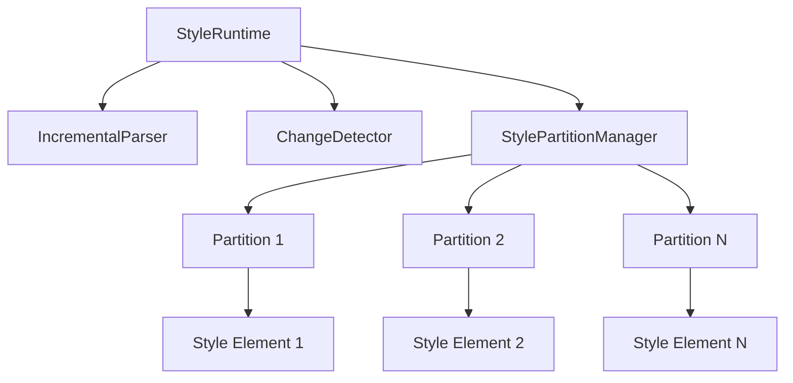

# 🚀 CSSMA v4 Runtime & Style Partition Manager Guide

## 🎯 Overview

CSSMA v4 dynamically generates and manages CSS utility classes at runtime. This guide covers how `StyleRuntime` and `StylePartitionManager` work together for fast, scalable style injection.

## 🏗️ Architecture Overview



## 🔧 StyleRuntime

### Class Overview
`StyleRuntime` parses class names to CSS, injects rules, and observes DOM mutations.

### Basic Usage
```typescript
import { StyleRuntime } from '@cssma/v4/runtime';

const runtime = new StyleRuntime({
  styleId: 'cssma-runtime',
  enableDev: process.env.NODE_ENV === 'development',
  insertionPoint: 'head',            // 'head' | 'body' | HTMLElement
  maxRulesPerPartition: 100          // delegated to StylePartitionManager
});

// Add classes programmatically
runtime.addClass('bg-blue-500 text-white p-4');

// Observe DOM and parse dynamically
runtime.observe(document.body, { scan: true });
```

## 🎨 StylePartitionManager

### What it does
Splits CSS rules across multiple <style> tags (partitions) to reduce parse/insertion cost per sheet.

### Minimal Usage
```typescript
import { StylePartitionManager } from '@cssma/v4/runtime';

const pm = new StylePartitionManager(document.head, 50, 'cssma-style-partition');

pm.addRule('.text-white{color:#fff}');
pm.addRules(['.p-4{padding:1rem}', '.m-2{margin:0.5rem}']);

pm.cleanup(); // remove all partition <style> tags
```

### Custom Insertion Point
```typescript
const container = document.getElementById('custom-styles')!;
const runtime = new StyleRuntime({ insertionPoint: container });
```

## 📚 API Reference (Essential)

### StyleRuntime
- addClass(classes: string | string[]): void
- observe(root?: HTMLElement, options?: { scan?: boolean; debounceMs?: number }): MutationObserver
- getStats(): { cachedClasses: number; /* ... */ }
- reset(): void
- clearCaches(): void
- destroy(): void

### StylePartitionManager
- constructor(insertionPoint: HTMLElement, maxRulesPerPartition?: number, idPrefix?: string)
- addRule(rule: string): boolean
- addRules(rules: string[]): { success: number; failed: number }
- hasRule(rule: string): boolean
- findRulePartition(rule: string): { id: string; styles: string[]; styleElement: HTMLStyleElement } | null
- cleanup(): void

## 🎯 Best Practices
- Keep `maxRulesPerPartition` between 50–200 depending on browser constraints.
- Use `observe({ scan: true })` on first mount to avoid FOUC.
- Prefer adding batched rules to minimize stylesheet mutations.
- Call `cleanup()`/`destroy()` on unmount to prevent leaks.