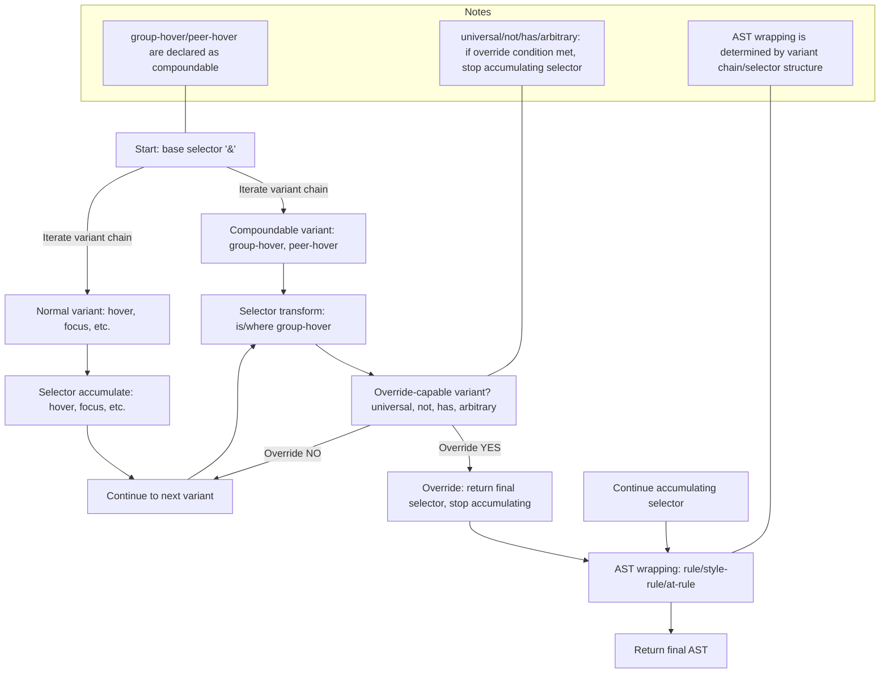

# v4 Variant Selector Accumulation/Override/Compound Rules (Analysis/Summary)



## 1. Core Structure of the Variant System
- **Variant Chain**: Multiple variants applied in order, e.g., `group-hover:not-hover:has-[.child]:*:`.
- **Each variant defines only its own role**: selector transform (accumulate/override), AST wrapping, at-rule wrapping, etc.
- **Cover combinations via accumulation/override rules rather than per-combination functions**

## 2. Official Rules for Selector Accumulation/Override
### (1) Basic accumulation
- The variant chain transforms (accumulates) selectors left → right
  - e.g., `hover:focus:bg-red-500` → `&:hover:focus`
### (2) Override (stop accumulation)
- **Certain variants (e.g., universal, not, has, arbitrary)** return an **override (final selector)** when preceded by group-hover/peer-hover, then accumulation stops
- Once override occurs, subsequent selector transforms are ignored
### (3) Compound rules
- **compoundable**: declare whether a variant can compound with others
- **compoundsWith**: declare when override is required in specific compounds
- **Actual behavior**: if universal comes after group-hover, universal returns the override selector (`&:is(:where(.group):hover > *)`) and stops accumulation

## 3. AST Wrapping Rules
- **Single pseudo/universal/not/has/arbitrary**: wrap as rule
- **Compound combinations (2+ including group/peer/has/not)**: wrap as style-rule
- **At-rules (media queries, etc.)**: wrap AST with at-rule; keep selector unchanged

## 4. Actual v4 Code Structure (based on variants.ts)
- **addVariant(name, generator, options)**: name, generator (accumulation/override/compound handling), options ({ compoundable, compoundsWith, ... })
- **matchVariant**: used for dynamic variant registration
- **compoundable/compoundsWith**: declare whether a variant compounds and which compounds require override
- **overrideSelector**: if generator returns `{ selector, override: true }`, stop accumulation

### (A) 주요 함수 시그니처/타입 예시 (variants.ts)
```ts
addVariant(
  name: string,
  generator: (selector: string, context: { ... }) => string | { selector: string, override?: boolean },
  options?: { compoundable?: boolean, compoundsWith?: string[], ... }
)
```
- **generator**: selector 변환 함수. `{ selector, override: true }` 반환 시 이후 누적 중단
- **compoundable/compoundsWith**: 조합 가능성/override 필요성 선언

### (B) Custom variant registration example
```ts
addVariant('children', '& > *');
// children:pl-4 → .children\:pl-4 > * { ... }
addVariant('my-variant', (selector) => `:is(.my-parent ${selector})`);
```

### (C) Tips for selector escaping
- Always escape className, arbitrary values, and special characters in selectors
- v4 internally uses utilities like escapeClassName and escapeSelector
- Example: `.\[\&\>\*\]\:underline > * { ... }` (arbitrary variant)

## 5. Simulation Examples (same as v4)
| Variant Chain                      | Selector result (v4)               | Accumulation/override |
|------------------------------------|---------------------------------------------|--------------------|
| `group-hover:*:bg-red-500`         | `&:is(:where(.group):hover > *)`            | universal overrides |
| `group-hover:not-hover:bg-red-500` | `&:is(:where(.group):hover *):not(:hover)`  | not overrides       |
| `peer-hover:has-[.child]:bg-red-500`| `&:is(:where(.peer):hover ~ *):has(.child)` | has overrides       |
| `sm:group-hover:*:bg-red-500`      | `@media (min-width: 640px) { &:is(:where(.group):hover > *) { ... } }` | universal overrides |
| `not-hover:focus:bg-red-500`       | `&:not(:hover):focus`                       | accumulate          |

## 6. Implementation Considerations
### (A) Selector accumulation/override logic
```ts
function processVariantChain(variants: string[], baseSelector: string): string {
  let result = baseSelector;
  
  for (const variant of variants) {
    const variantResult = processVariant(variant, result);
    
    if (variantResult.override) {
      // Stop accumulation when override occurs
      return variantResult.selector;
    }
    
    // Accumulate selector
    result = variantResult.selector;
  }
  
  return result;
}
```

### (B) Handling compoundable/compoundsWith
```ts
function isCompoundable(variant: string): boolean {
  return variant === 'group-hover' || variant === 'peer-hover';
}

function needsOverride(currentVariant: string, previousVariant: string): boolean {
  if (currentVariant === 'universal' && isCompoundable(previousVariant)) {
    return true;
  }
  // Other override conditions...
  return false;
}
```

## 7. Key v4 code related to selector override/compound (variants.ts)
- **addVariant**: declare compoundability with options
- **processVariant**: handle each variant's selector transform
- **overrideSelector**: return final selector when override conditions are met
- **compoundSelector**: combine selectors for compoundable variants

### (A) Core logic flow
1. **Parse variant chain**: `group-hover:not-hover:has-[.child]:*:`
2. **Process sequentially**: handle each variant in order
3. **Check override**: stop accumulation when conditions are met
4. **Accumulate selector**: if not overridden, keep accumulating
5. **AST wrapping**: wrap final selector into AST structure

### (B) Selector escaping
- **className escape**: `.group-hover\:bg-red-500` → `.group-hover\:bg-red-500`
- **arbitrary value escape**: `[&>*]` → `\[\&\>\*\]`
- **special characters in selectors**: `:is(.parent > *)` → `:is\(\.parent\s\>\s\*\)`

### (C) Performance optimizations
- **variant cache**: cache results for identical variant chains
- **selector optimization**: remove unnecessary nesting, merge identical selectors
- **AST optimization**: merge duplicate at-rules and rules

## 8. 실제 사용 예시 및 테스트
### (A) 기본 variant chain
```ts
// hover:focus:bg-red-500
const variants = ['hover', 'focus'];
const result = processVariantChain(variants, '&');
// 결과: '&:hover:focus'
```

### (B) compoundable variant
```ts
// group-hover:*:bg-red-500
const variants = ['group-hover', '*'];
const result = processVariantChain(variants, '&');
// 결과: '&:is(:where(.group):hover > *)'
```

### (C) override variant
```ts
// group-hover:not-hover:bg-red-500
const variants = ['group-hover', 'not-hover'];
const result = processVariantChain(variants, '&');
// 결과: '&:is(:where(.group):hover *):not(:hover)'
```

### (D) 복합 at-rule
```ts
// sm:group-hover:*:bg-red-500
const variants = ['sm', 'group-hover', '*'];
const result = processVariantChain(variants, '&');
// 결과: '@media (min-width: 640px) { &:is(:where(.group):hover > *) }'
```

## 9. 에러 처리 및 예외 상황
### (A) 잘못된 variant chain
```ts
// *:group-hover (universal이 group-hover 앞에 오면 안됨)
// 에러: "Universal variant must come after compoundable variant"
```

### (B) 순환 참조 방지
```ts
// group-hover:group-hover (동일한 variant 중복)
// 경고: "Duplicate variant detected: group-hover"
```

### (C) selector 유효성 검증
```ts
// group-hover:[invalid-selector]
// 에러: "Invalid selector syntax: [invalid-selector]"
```

## 10. 확장성 및 커스터마이징
### (A) 커스텀 variant 등록
```ts
addVariant('my-custom', (selector) => `:is(.my-parent ${selector})`);
addVariant('my-compound', (selector) => `:is(.my-wrapper ${selector})`, {
  compoundable: true,
  compoundsWith: ['group-hover']
});
```

### (B) variant 플러그인 시스템
```ts
const myVariantPlugin = {
  name: 'my-variants',
  variants: {
    'my-variant': (selector) => `:is(.my-parent ${selector})`,
    'my-compound': (selector) => `:is(.my-wrapper ${selector})`
  }
};
```

### (C) 동적 variant 생성
```ts
function createResponsiveVariant(breakpoint: string) {
  return (selector: string) => `@media (min-width: ${breakpoint}) { ${selector} }`;
}

addVariant('sm', createResponsiveVariant('640px'));
addVariant('md', createResponsiveVariant('768px'));
```

## 11. 심화:  v4 Variant 시스템의 실전 확장/테스트/보안/호환성
### (A) 확장성 고려사항
- **variant 순서**: variant의 적용 순서(variant order)에 따라 CSS specificity와 실제 적용 결과가 달라짐
- **selector 복잡성**: 복잡한 selector 조합 시 성능과 가독성 고려
- **브라우저 호환성**: :is(), :where(), :has() 등 최신 CSS 선택자 지원 여부 확인

### (B) 설정 기반 variant 시스템
```ts
// cssma.config.js
module.exports = {
  variants: {
    extend: {
      'my-variant': ['hover', 'focus'],
      'my-compound': ['group-hover', 'peer-hover']
    }
  }
};
```

### (C) 보안 및 검증
- **selector validation**: 사용자 입력으로부터 생성된 selector의 유효성 검증
- **CSS injection 방지**: 악의적인 selector 입력으로부터 보호
- ** v4는 내부적으로 selector validation, escape, 허용 범위 제한 등 방어 로직을 둠**

### (D) 테스트 전략
- **unit test**: 각 variant의 개별 동작 테스트
- **integration test**: variant chain의 조합 테스트
- **AST 구조가 복잡해질수록(특히 at-rule+style-rule+arbitrary 중첩) 최종 CSS output이  v4와 완전히 일치하는지 검증 필요**

### (E) 플러그인 시스템
```ts
// cssmacss/plugin
const plugin = require('cssmacss/plugin');

module.exports = plugin(({ addVariant }) => {
  addVariant('my-variant', (selector) => `:is(.my-parent ${selector})`);
});
```

### (F) 성능 최적화
- **variant cache**: 동일한 variant chain의 처리 결과 캐싱
- **selector 최적화**: 불필요한 중첩 제거, 동일한 selector 병합
- **AST 최적화**: 중복된 at-rule, rule 병합

### (G) 브라우저 호환성
- **CSS 선택자**: :is(), :where(), :has() 등 최신 CSS 선택자 지원
- **CSS 속성**: 최신 CSS 속성들의 브라우저 지원 여부 확인
- ** v3 → v4로 마이그레이션 시 variant 시스템의 breaking change/호환성 이슈**

## 12.  v4 Variant 시스템의 진짜 wrapping/flatten/override 구조와 order 기반 루프의 한계
### (A) 단순 order+루프의 한계
- **순서 기반 처리**: variant chain을 순서대로 처리하는 것은 단순하지만 한계가 있음
- **복잡한 조합**: group-hover + universal + not + has 등의 복잡한 조합을 단순 순서로는 처리할 수 없음
- **의존성 처리**: variant 간의 의존성이나 상호작용을 순서만으로는 파악할 수 없음

### (B)  v4의 진짜 방식: wrapping/flatten/override 정책 위임
- ** v4는 각 variant(플러그인)가**
  - `wrapping`: AST를 어떻게 감쌀지
  - `flatten`: selector를 어떻게 평탄화할지
  - `override`: 언제 selector 누적을 중단할지
- **를 선언하고, 엔진은 그 정책을 그대로 적용하는 구조**

### (C) 정책 기반 시스템의 장점
- **확장성**: 새로운 variant를 추가할 때 기존 코드 수정 없이 정책만 선언
- **정확도**: 각 variant가 자신의 동작을 정확하게 정의
- **커스터마이징**: 사용자가 variant의 동작을 자유롭게 커스터마이징 가능

### (D) cssma-v4의 개선 방향
- **단순 order+루프만으로는  v4의 의미적 wrapping/flatten/override를 완벽히 구현할 수 없음**
- **variant 플러그인에 wrapping/flatten/override 정책을 선언하게 하고, 엔진은 그 정책을 그대로 적용하는 구조가 진짜  v4 방식**
- **cssma-v4도 이 구조로 개선하면 확장성/정확도/커스텀 생태계가  v4와 동일해짐**

## 결론
- **variant 시스템은 단순한 순서 기반 처리가 아니라, 정책 기반의 복잡한 시스템**
- **각 variant가 자신의 동작을 정확하게 정의하고, 엔진이 그 정책을 적용하는 구조가 핵심**
- **이를 통해 무한한 조합과 확장성을 제공하면서도 일관된 동작을 보장**
- **cssma-v4도 이 방향으로 발전시켜야  v4와 동등한 수준의 variant 시스템을 제공할 수 있음** 