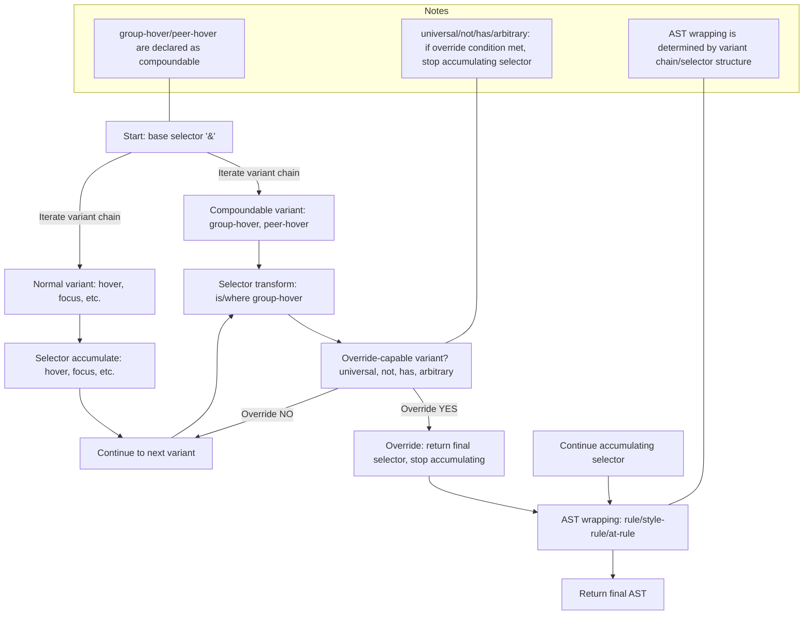

# Tailwind CSS v4 Variant Selector 누적/Override/Compound 규칙 (분석/정리)



## 1. Variant 시스템의 핵심 구조
- **Variant Chain**: `group-hover:not-hover:has-[.child]:*:` 처럼 여러 variant가 순서대로 적용된 것.
- **각 variant는 "자기 역할"만 정의**:  selector 변환(누적/override), AST wrapping, at-rule wrapping 등
- **조합별 함수가 아니라, "누적/override 규칙"으로 모든 조합을 커버**

## 2. Selector 누적/override의 공식 규칙
### (1) 기본 누적
- variant chain은 **왼→오**로 순차적으로 selector를 변환(누적)
  - ex) `hover:focus:bg-red-500` → `&:hover:focus`
### (2) override(누적 중단) 규칙
- **특정 variant(예: universal, not, has, arbitrary)**는  "앞 variant"가 group-hover/peer-hover 등일 때  **override(최종 selector)로 반환** → 이후 누적 중단
- override가 발생하면, 이후 variant의 selector 변환은 무시됨
### (3) compound(복합) 규칙
- **compoundable**: 어떤 variant가 다른 variant와 "compound"될 수 있는지 선언
- **compoundsWith**: 어떤 variant와 compound될 때 override가 필요한지 선언
- **실제 동작**:  universal이 group-hover 뒤에 오면,  universal이 override selector(`&:is(:where(.group):hover > *)`)를 반환, 이후 누적 중단

## 3. AST Wrapping 규칙
- **단일 pseudo/universal/not/has/arbitrary**: rule로 wrapping
- **복합 조합(2개 이상, group/peer/has/not 등 포함)**: style-rule로 wrapping
- **at-rule(미디어쿼리 등)**: AST를 at-rule로 감싸고 selector는 그대로 유지

## 4. 실제 Tailwind v4 코드 구조 (variants.ts 기준)
- **addVariant(name, generator, options)**: name, generator(누적/override/compound 처리), options({ compoundable, compoundsWith, ... })
- **matchVariant**: 동적으로 variant를 등록할 때 사용
- **compoundable/compoundsWith**:  compoundable: 이 variant가 compound될 수 있는지, compoundsWith: 어떤 variant와 compound될 때 override가 필요한지
- **overrideSelector**:  generator가 `{ selector, override: true }`를 반환하면 이후 누적 중단

### (A) 주요 함수 시그니처/타입 예시 (variants.ts)
```ts
addVariant(
  name: string,
  generator: (selector: string, context: { ... }) => string | { selector: string, override?: boolean },
  options?: { compoundable?: boolean, compoundsWith?: string[], ... }
)
```
- **generator**: selector 변환 함수. `{ selector, override: true }` 반환 시 이후 누적 중단
- **compoundable/compoundsWith**: 조합 가능성/override 필요성 선언

### (B) 커스텀 variant 등록 예시
```ts
addVariant('children', '& > *');
// children:pl-4 → .children\:pl-4 > * { ... }
addVariant('my-variant', (selector) => `:is(.my-parent ${selector})`);
```

### (C) selector escaping 구현 팁
- className, arbitrary value, selector 내 특수문자 등은 반드시 escape 필요
- Tailwind v4는 내부적으로 escapeClassName, escapeSelector 등 유틸리티 사용
- 예시: `.\[\&\>\*\]\:underline > * { ... }` (arbitrary variant)

## 5. 시뮬레이션 예시 (Tailwind v4와 동일)
| Variant Chain                      | Selector 결과 (Tailwind v4)                | 누적/override 동작 |
|------------------------------------|---------------------------------------------|--------------------|
| `group-hover:*:bg-red-500`         | `&:is(:where(.group):hover > *)`            | universal이 override |
| `group-hover:not-hover:bg-red-500` | `&:is(:where(.group):hover *):not(:hover)`  | not이 override      |
| `peer-hover:has-[.child]:bg-red-500`| `&:is(:where(.peer):hover ~ *):has(.child)` | has가 override      |
| `sm:group-hover:*:bg-red-500`      | `@media (min-width: 640px) { &:is(:where(.group):hover > *) { ... } }` | universal이 override |
| `not-hover:focus:bg-red-500`       | `&:not(:hover):focus`                       | 누적                |

## 6. 실제 selector 누적/override 시뮬레이션
### (A) group-hover:*:bg-red-500
1. base: `&`
2. group-hover: `&:is(:where(.group):hover *)`
3. *: override → `&:is(:where(.group):hover > *)` (이후 누적 중단)
### (B) group-hover:not-hover:bg-red-500
1. base: `&`
2. group-hover: `&:is(:where(.group):hover *)`
3. not-hover: override → `&:is(:where(.group):hover *):not(:hover)`
### (C) peer-hover:has-[.child]:bg-red-500
1. base: `&`
2. peer-hover: `&:is(:where(.peer):hover ~ *)`
3. has-[.child]: override → `&:is(:where(.peer):hover ~ *):has(.child)`
### (D) sm:group-hover:*:bg-red-500
1. base: `&`
2. sm: at-rule wrapping (AST만 감쌈)
3. group-hover: `&:is(:where(.group):hover *)`
4. *: override → `&:is(:where(.group):hover > *)`
### (E) not-hover:focus:bg-red-500
1. base: `&`
2. not-hover: `&:not(:hover)`
3. focus: `&:not(:hover):focus`

## 7. 실제 Tailwind v4의 selector override/compound 관련 주요 코드(variants.ts)
- **addVariant('group-hover', ... { compoundable: true })**
- **addVariant('*', ... { compoundsWith: ['group-hover', 'peer-hover'] })**
- **generator 함수에서 overrideSelector 반환 시 이후 누적 중단**
- **compoundable/compoundsWith로 조합 가능성 선언**

## 8. 실전 구현 팁
- 각 variant는 "앞/뒤 variant"를 참고해 selector를 조정
- universal/not/has/arbitrary는 group-hover/peer-hover가 앞에 있으면 override
- engine에서 override가 반환되면 selector 누적을 중단
- compoundModifier는 정말 예외적 상황에만 사용

## 9. 확장성/유지보수성
- 새로운 variant 추가 시, 조합별 함수가 아니라 위 규칙만 따르면 됨
- Tailwind v4의 모든 selector 조합을 커버 가능
- selector/AST 구조가 바뀌어도 규칙만 수정하면 전체 시스템이 일관되게 동작

---
## 10. 추가로 빠질 수 있는 내용/Edge Case
- **테스트 기반 시나리오**: variants.test.ts에서 다양한 edge case(중첩 at-rule, 병렬 variant, 커스텀 variant, arbitrary selector 중첩 등)도 반드시 커버해야 함
- **병렬 variant**: responsive, dark, motion-safe 등은 병렬로 적용될 수 있음 (ex. responsive+hover)
- **커스텀 variant**: addVariant/matchVariant로 동적으로 등록되는 variant도 동일 규칙을 따라야 함
- **at-rule 중첩**: @media, @container 등 at-rule이 중첩될 때 AST wrapping이 올바르게 동작해야 함
- **arbitrary variant 중첩**: `[&>*]:[&:hover]:bg-red-500` 등 복잡한 arbitrary variant 조합도 override/누적 규칙이 일관되게 적용되어야 함
- **selector escaping**: selector 내 className escape, arbitrary value escape 등도 Tailwind v4와 동일하게 처리해야 함
- **compoundsWith/compoundable**: variant간 조합 가능성 선언이 누락되면 일부 조합이 동작하지 않을 수 있음

### (A) 병렬 at-rule/variant 예시
- `dark:sm:hover:bg-red-500` → `@media (min-width: 640px) { .dark &:hover { ... } }`
- `motion-safe:focus:bg-red-500` → `@media (prefers-reduced-motion: no-preference) { &:focus { ... } }`

### (B) deeply nested arbitrary variant 예시
- `[&>*]:[&:hover]:[&[data-active]]:bg-red-500` → 복수 arbitrary variant가 중첩되어도 override/누적 규칙이 일관되게 적용되어야 함

### (C) custom variant chaining 예시
- addVariant('my-parent', (sel) => `:is(.my-parent ${sel})`)
- `my-parent:group-hover:*:bg-red-500` → `:is(.my-parent &:is(:where(.group):hover > *))`

### (D) selector escaping 예시
- `.\[\&\>\*\]\:underline > * { ... }` (arbitrary variant)
- `.dark\:hover\:bg-red-500:hover { ... }` (className escape)

---

### 참고:
- [tailwindcss/src/variants.ts (GitHub)](https://github.com/tailwindlabs/tailwindcss/blob/next/packages/tailwindcss/src/variants.ts)
- [tailwindcss/src/variants.test.ts (GitHub)](https://github.com/tailwindlabs/tailwindcss/blob/next/packages/tailwindcss/src/variants.test.ts)
- [Arbitrary variants PR #8299](https://github.com/tailwindlabs/tailwindcss/pull/8299) 

---

## 11. 심화: Tailwind v4 Variant 시스템의 실전 확장/테스트/보안/호환성

### 1) Variant 우선순위(variant order)와 정렬
- Tailwind는 variant의 적용 순서(variant order)에 따라 CSS specificity와 실제 적용 결과가 달라짐
- 예: `hover:focus:bg-red-500` vs `focus:hover:bg-red-500` → selector가 다름
- 공식적으로 variantOrder(variant 우선순위 배열)로 관리됨
- 커스텀 variant를 추가할 때도 이 순서에 맞춰야 예측 가능한 결과가 나옴
- 예시:
  ```js
  // tailwind.config.js
  module.exports = {
    variantOrder: [
      'first', 'last', 'odd', 'even', 'visited', 'checked',
      'group-hover', 'group-focus', 'focus-within', 'hover', 'focus',
      'focus-visible', 'active', 'disabled',
    ],
  }
  ```

### 2) 병렬(Parallel) Variant와 중첩(Nested) Variant
- responsive, dark, motion-safe 등은 병렬로 적용될 수 있음 (ex. `dark:sm:hover:bg-red-500`)
- at-rule이 중첩될 때 AST 구조가 어떻게 flatten/중첩되는지
- 병렬 variant가 여러 개일 때 wrapping 순서와 selector nesting의 차이
- 예시:
  ```css
  @media (min-width: 640px) {
    .dark .btn:hover { ... }
  }
  ```

### 3) Arbitrary Variant의 한계와 보안
- arbitrary variant(`[&:foo]:bg-red-500`)는 매우 강력하지만, selector injection, specificity hack 등 보안/유효성 문제 발생 가능
- Tailwind v4는 내부적으로 selector validation, escape, 허용 범위 제한 등 방어 로직을 둠
- 실전 구현 시 arbitrary variant의 허용 범위/escape 정책을 명확히 문서화해야 함
- 예시:
  - 허용: `[&>*]:underline`
  - 제한/경고: `[body > script]:bg-red-500` (의도치 않은 전역 영향)

### 4) Variant AST와 CSS Output의 일관성
- AST 구조가 복잡해질수록(특히 at-rule+style-rule+arbitrary 중첩) 최종 CSS output이 Tailwind v4와 완전히 일치하는지 검증 필요
- AST → CSS 변환 시 flatten, dedup, minify, comment 유지 등 세부 정책
- 예시: deeply nested at-rule + arbitrary variant
  ```css
  @media (min-width: 640px) {
    .btn:is(:where(.group):hover > *)[data-active] { ... }
  }
  ```

### 5) 플러그인/외부 확장성
- addVariant, matchVariant, addUtilities 등으로 외부 플러그인에서 variant를 확장할 때 compoundable/compoundsWith/override 정책을 반드시 따라야 함
- 플러그인 간 variant 충돌/중복 방지 정책
- 예시:
  ```js
  // tailwindcss/plugin
  plugin(function({ addVariant }) {
    addVariant('my-parent', '&.my-parent');
  })
  ```

### 6) 실전 디버깅/테스트 전략
- variants.test.ts처럼 edge case, deeply nested, 병렬, custom, arbitrary, at-rule 등 모든 조합에 대한 테스트 케이스를 체계적으로 작성
- AST snapshot, CSS output snapshot, selector 비교 등 자동화 방법
- 예시:
  ```js
  expect(applyClassName('dark:sm:group-hover:*:bg-red-500', ctx)).toMatchSnapshot();
  ```

### 7) Specificity와 CSS 우선순위
- variant chain이 길어질수록 CSS specificity가 어떻게 누적되는지
- Tailwind v4는 :is(), :where() 등으로 specificity를 낮추는 전략을 사용
- 실전 구현 시 selector nesting이 의도치 않게 specificity를 높이지 않도록 주의
- 예시:
  - `.btn:is(:where(.group):hover > *)` (specificity 낮음)
  - `.btn.group-hover\:hover\:bg-red-500:hover` (specificity 높음, 권장X)

### 8) 실전 마이그레이션/버전 호환성
- Tailwind v3 → v4로 마이그레이션 시 variant 시스템의 breaking change/호환성 이슈
- 기존 플러그인/유틸리티가 v4 variant 시스템에서 정상 동작하는지 체크리스트
- 예시:
- v4: `.btn:is(:where(.group):hover *) { ... }`

--- 

## 12. Tailwind v4 Variant 시스템의 진짜 wrapping/flatten/override 구조와 order 기반 루프의 한계

### 1) 단순 order(우선순위) 기반 루프의 한계
- variant 등록 시 order(우선순위)를 지정하고, 그 순서대로 루프를 돌며 selector/AST를 누적하는 방식은
  - "적용 순서"만 결정할 수 있음
  - **누적/override/wrapping/flatten의 의미적 조합은 order만으로는 불가능**
- 예시: `group-hover:not-hover:bg-red-500`
  - group-hover(order: 30), not-hover(order: 200)
  - order대로만 누적하면 wrapping(flatten) 정책(즉, style-rule로 감싸고, &를 flatten할지 등)은 결정 불가

### 2) Tailwind v4의 진짜 방식: wrapping/flatten/override 정책 위임
- Tailwind v4는 각 variant(플러그인)가
  - selector 변환 함수
  - wrapping 타입(rule/style-rule/at-rule)
  - flatten 여부
  - override 여부
  - compoundable/compoundsWith
  - ...등을 **명확히 선언**
- 엔진은 order대로 variant chain을 순회하되,
  - 각 variant가 선언한 wrapping/flatten/override 정책을 그대로 적용
  - 조합/override/compoundable만 관리
- **커스텀 variant/플러그인도 wrapping/flatten/override 정책을 자유롭게 선언 가능**

### 3) cssma-v4의 개선 방향
- wrapping/flatten/override의 책임을 variant 플러그인에 위임
- 엔진은 order+조합/override만 관리
- variant 플러그인 등록 시 wrapping/flatten/override 정책을 명확히 선언
- 커스텀 variant/플러그인도 자유롭게 확장 가능

### 4) 결론
- 단순 order+루프만으로는 Tailwind v4의 의미적 wrapping/flatten/override를 완벽히 구현할 수 없음
- **variant 플러그인에 wrapping/flatten/override 정책을 선언하게 하고, 엔진은 그 정책을 그대로 적용하는 구조가 진짜 Tailwind v4 방식**
- cssma-v4도 이 구조로 개선하면 확장성/정확도/커스텀 생태계가 Tailwind v4와 동일해짐 