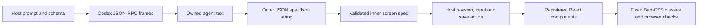

# Measurement stage result and data flow (#469)

## Decision

**End this measurement stage. Use complete validated JSON for the next demo.**
The sole fresh owner-approved launch failed before a model turn. It has no UI timing samples and
shows no early-screen benefit. It does not show that early rendering is impossible.
No retry, fallback, new protocol-fix cycle or further paid experiment follows from this result.

The existing [#460 loopback demo](../barocss-render-loop/README.md) already implements Generate →
name input → Save → confirmation with complete validated responses. Its default mode uses authored
mock data and calls no model. The existing [#458 corpus replay](../barocss-render-corpus/README.md)
uses 18 verified historical actual responses, including the accepted #460 calibration pair. Reuse
these paths; #469 adds no new package, rendering capability or duplicate demo.

One concrete remaining gap is **an accepted current-host app-server model turn under the unchanged
exact session contract**. Genuine progressive timing remains unmeasured. That gap does not block
deterministic verification of the existing complete-response demo. Planner owns any later product
scope; this task authorizes no new live run, release or deployment.

## Actual run

Fresh direct human approval, a distinct immutable private GO and the
[#468 exact prospective runtime ACCEPT](https://github.com/barocss/barocss/issues/468#issuecomment-5905476770)
bound runtime `693dc5a6336cddb930fdfd368b4cf1df5901b753`, Codex 0.156.1, the current private host
fingerprint, `gpt-6.1-sol`/high, two sessions, four new reservations maximum, 180 seconds per turn,
720 seconds total and one launch. The accepted runtime checkout stayed clean. Old #464/#466 GO
records were not reused. The fresh launch claim is consumed even though three slots remain unused.

| Observed stage | Count |
| --- | ---: |
| Native app-server launches / startup reservations | 1 / 1 |
| Recorded initialize attempts / observed responses | 1 / 1 |
| Recorded thread/start attempts / observed native responses | 1 / 1 |
| Profile-accepted sessions | 0 |
| Model turn/start attempts / completed turns | 0 / 0 |
| Accepted UI specs / host actions | 0 / 0 |
| Preview, action-ready and completion samples | 0 each |
| Browser observations / same-session baseline samples | 0 / 0 |

The original captured stdout has 3,687 bytes in six complete JSON frames: two responses and four
notifications. Notification methods are `remoteControl/status/changed`, `account/updated`,
`thread/started` and `warning`. The original stderr has 400 bytes and remains private. Receipt is
not acceptance: the warning is retained as evidence, not granted an allowlist exception.

The actual thread/start response has one `instructionSources` entry; the frozen host contract requires
an empty or absent list. The returned thread has `source: vscode`; the contract requires `appServer`.
The response's model, provider, effort, approval policy/reviewer, cwd and read-only/no-network sandbox
match their checks. The unchanged validator stops with `Effective session settings or identity differ`.
Both the response and thread-start notification are retained for independent inspection. These are
observed profile mismatches, not an inferred model refusal, malformed JSON or approval denial. Native
thread creation is observed; the host does not accept it as an owned profile session or start a turn.
The native Thread schema permits sources beyond the narrower approved host contract.

Request metadata records initialize at approximately 3.365 seconds and thread/start at 4.938 seconds
from launcher start. The stdout chunk containing the thread/start response arrives at approximately
6.681 seconds. The thread-start/warning notifications arrive at 6.683 seconds. Whole-run elapsed
6.764 seconds includes browser startup and cleanup. These are local startup/receipt observations,
**not model or UI latency**. N=0 has no median, min–max, paired baseline or early-paint comparison.
Browser observers open at 1200×800 and 390×800; observations/actions/baselines/network errors are all
empty. No accepted output exists to replay and no screen screenshot is produced by this live run.

## What data remains

The [data-lineage manifest](./DATA-LINEAGE-469.json) lists retained files, fields, counts, missing stages
and validation/loss boundaries. Private originals remain under the fresh #469 result directory in
`~/.barocss-ai/v3/private-*`; historical artifacts and ledgers are not overwritten. Actual account,
thread, environment and instruction-source values, host fingerprints and raw-byte hashes remain
private. Public counts and contract hashes are sufficient to identify the result without those values.

| Retained artifact | Meaning and limit |
| --- | --- |
| `stdout.bin`, `stderr.bin` | Original observed stream bytes. Stderr is diagnostic data, not agent text. Capture stops at failure; it does not prove that all possible native output was captured. |
| `chunks.jsonl` | `stream`, `receivedMs`, `length`, `endOffset`: byte offsets and local receipt times. These retain frame/chunk provenance lost by parsing. |
| `requests.jsonl` | `id`, `method`, `sentMs`: logged before the attempted write. Serialized request bodies are not captured. The client `initialized` notification is not independently logged. |
| `events.jsonl` | `receivedMs` plus the original notification object before validation; unaccepted events remain evidence. Response frames are in stdout, not this notification log. |
| `report.json` | Runtime/plan/profile binding, status/error, sessions/turns, reservation/byte counts and elapsed time. Empty session/turn lists are material evidence. |
| Canonical `launch.json`, `1-01-initial.json`; `reservations.jsonl` | One launch claim and one charged startup slot, with decision binding and wall-clock timestamps. Request uncertainty never refunds a slot. |
| `browser/report.json` | Installed asset/version provenance and viewports; empty observations/actions/baselines. No model calls by the browser observer. |
| Separate private parsed-frames and lineage JSON | Reconstructed native frames, validator results, artifact/ledger hashes and receipt stages. They are derived after the run and preserve the originals. |

`turn-N.json`, `actions.jsonl` and `browser/shots/*.png` are absent. No accumulated agent message,
outer `specJson`, inner screen, host action or state snapshot was produced by #469. A fresh private
scratch directory retains `schema.json`, but no model prompt/schema was sent in a turn/start request.
The source and frozen inputs reconstruct planned request bodies; that is not proof of wire transmission.

## How data is transformed



The diagram describes the reviewed successful path. **#469 stops at startup validation before P is
sent as a model turn and before T exists.**

1. **Host inputs.** `buildCliPrompt` uses a frozen scenario or the host's save action. The host owns
   model, effort, sandbox and output schema. User text is data; it cannot choose command arguments,
   filesystem paths or tools. `output.schema.json` checks only an outer object with one `specJson`
   string; it does not validate the encoded screen.
2. **Bytes → RPC frames.** `rpc.mjs` uses fatal UTF-8 decoding, complete LF frames, object JSON,
   request IDs, exclusive result/error fields and byte/event ceilings. JSON.parse loses whitespace,
   escape spelling and duplicate keys; raw bytes remain the reference. Request bodies are not a raw
   artifact, so source reconstruction must be labelled as reconstruction.
3. **Owned turn → text.** After accepted session/turn settings and identities, the host routes only
   its process/thread/turn/item events. The reducer concatenates agent-message deltas. Completed item
   text must match accumulated text; the final completed turn must contain exactly that accepted
   final agent message. Tools, unknown events and integrity drift fail. Transport envelopes are
   removed from the text projection but remain in private stdout/events.
4. **Text → outer JSON → inner screen.** The host requires a complete outer response with exactly
   one string field. It parses that string separately, without output repair, then calls `validateSpec`.
   JSON parsing is not duplicate-key rejection. The allowlist checks root/elements, graph reachability,
   component types, props, style choices and the fixed state/action contract. There is no arbitrary
   HTML, script, CSS or class input.
5. **Screen → host state/action.** A valid candidate can be previewed. Matching item completion makes
   it action-ready; authoritative turn completion commits it. The host owns revision and name. A save
   can be queued but is released only after successful commit. Failure retains the previous committed
   screen and cancels the queued action. The next response must confirm the exact host-supplied name.
   Screens and snapshots omit raw protocol envelopes; they are not substitutes for the raw recording.
6. **Screen/state → renderer → browser.** `packages/barocss-render` revalidates the spec, renders only
   registered React components, and maps reviewed style values to fixed BaroCSS classes. The host
   starts the BaroCSS browser runtime. Browser reports compare content, exact spec, layout/style,
   action state, overflow and network behavior at fixed viewports. Screenshots and selected measurements
   do not prove arbitrary UI support, language quality, model value or early-generation latency.

The **research host calls Codex**. The **private package renders validated data** and does not call a
model, own CLI sessions or execute model code. Package code stays in `packages/barocss-render`;
study runners, private recordings and replay orchestration stay outside the package.

## Separate evidence classes

- **Actual historical #458:** 18 verified complete responses across nine eligible two-turn rows;
  row 10 remains excluded at the frozen ceiling. The accepted #460 pair is included, not counted again.
- **Actual #460 loop:** one accepted real complete-response two-turn interaction, with recorded
  inputs/outputs. It demonstrates that bounded interaction, not streaming or a general timing gain.
- **Synthetic #461 replay:** saved actual #458 responses with authored event chunks and pacing.
  Its 144 passing viewport/stage observations prove replay behavior, not native emission timing.
- **Source-shaped #467/#468 fixtures:** schema/source-shaped notifications and saved startup bytes.
  No model call; passing fixtures do not establish effective current-host session settings.
- **Actual new #469:** native startup only, one rejected profile response, zero model/UI samples.
- **Authored mock demo:** deterministic complete-JSON interaction; its local times are not model latency.

## Verification and next usable path

The focused loopback browser/controller verification passed **12/12** tests. It covered the complete
Generate/input/save/confirmation flow, wrong-origin/token requests before generation, pending-input
freeze, cancellation/restart, stale polling/actions, exact-name handling and malformed output. One
private authored confirmation screenshot was retained separately from the empty live-run evidence.
Original/current progressive plan checks, the private six-frame/one-claim audit and historical corpus
lineage verification pass. Prior #466 raw artifact and canonical ledger hashes remain unchanged.

The #458 frozen source list includes the package README. A proposed clarification made that check
fail during this task; the clarification was removed, restoring its exact frozen bytes. No frozen
plan was rewritten. Package documentation already states that the research host owns model calls.

No-model original/current plan checks and the targeted demo tests are rerunnable from the repository
root using already installed dependencies. No new downloads or native Codex probes are needed:

```sh
NODE=/Users/user/Library/pnpm/nodejs/22.19.0/bin/node
"$NODE" scripts/barocss-render-progressive/freeze.mjs --verify
"$NODE" --input-type=module -e "import {verifyCurrentHostPlan} from './scripts/barocss-render-progressive/current-host-gate.mjs'; console.log(verifyCurrentHostPlan())"
export JR_ROOT=/Users/user/.barocss-ai/v3/wt/issue-446/scripts/json-render-446/scratch/jr
export PW_DIR=/Users/user/github/ai-based/abs/node_modules/.pnpm/playwright-core@1.60.0/node_modules/playwright-core
export REPO_DEPS_ROOT=/Users/user/.barocss-ai/v3/integration
"$NODE" --test scripts/barocss-render-loop/browser.test.mjs scripts/barocss-render-loop/controller.test.mjs
# Interactive authored demo; does not call a model:
"$NODE" scripts/barocss-render-loop/serve.mjs
```

Existing corpus `verify.mjs --claim` checks historical private outputs without dispatching Codex;
keep its full output private. Existing corpus replay accepts a fresh private output path and reuses
those verified complete responses. Do not reuse a prior replay output directory or any paid launch
claim. The Issue records exact independent evidence/documentation Review, final commit, local no-ff
merge and post-integration checks. No product runtime or published package changes are included.
